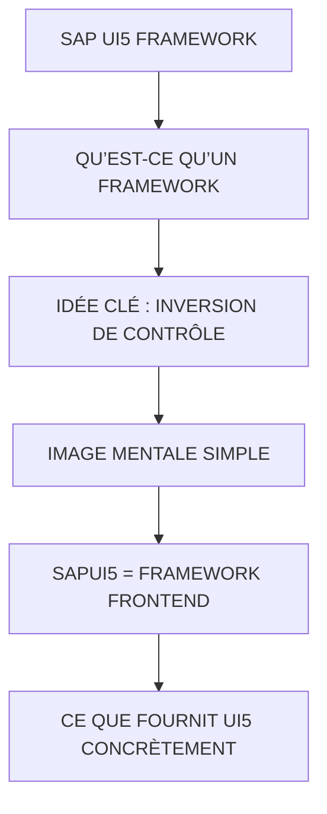

# 🌸 SAP UI5 FRAMEWORK

## 🌺 OBJECTIFS

- [ ] Expliquer le rôle de **SAP UI5 FRAMEWORK** dans le contexte présenté.
- [ ] Comprendre **qu’est-ce qu’un framework**.
- [ ] Mettre en œuvre **idée clé : inversion de contrôle** dans un exemple guidé.
- [ ] Reconnaître les erreurs fréquentes et les limites de l’approche.
## 🌺 VUE D'ENSEMBLE

> [!IMPORTANT]
> Vérifier la version SAPUI5 ciblée par l’application. La disponibilité d’une API, d’une propriété ou d’un événement peut dépendre de cette version.

## 🌺 QU’EST-CE QU’UN FRAMEWORK

Un framework est un ensemble structuré de code, règles et outils qui impose une façon de développer une application.

Différence simple :

- Librairie : tu appelles des fonctions quand tu veux
- Framework : c’est lui qui pilote ton application et appelle ton code

## 🌺 IDÉE CLÉ : INVERSION DE CONTRÔLE

Sans framework :

     ton code contrôle tout

Avec framework :

     le framework contrôle le cycle de l’application
     ton code est "branché" dessus

## 🌺 IMAGE MENTALE SIMPLE

- Sans framework : moteur manuel
- Avec framework : voiture automatique
  - tu n’as pas tout à gérer
  - tu te connectes aux commandes existantes

## 🌺 SAPUI5 = FRAMEWORK FRONTEND

SAPUI5 est un framework JavaScript complet pour applications web SAP (Fiori).

Il fournit :

- architecture applicative
- composants UI
- binding de données
- routing
- cycle de vie
- gestion OData
- gestion responsive

## 🌺 CE QUE FOURNIT UI5 CONCRÈTEMENT

UI (interface)

     sap.m.Button
     sap.m.Input
     sap.m.Table
     sap.m.Page

Data binding (liaison données)

     {path}
     modèles JSON / OData

Architecture

     Controller
     View (XML)
     Component

Routing

     navigation entre pages

Services

     OData V2 / V4 integration

## 🌺 RÔLE DU FRAMEWORK UI5

UI5 gère automatiquement :

     création des vues
     instanciation des controllers
     binding des données
     lifecycle (onInit, onExit)
     gestion mémoire
     navigation
     communication backend

## 🌺 CE QUI N'EST PLUS FAIT MANUELLEMENT

Sans UI5 :

     DOM manipulation
     AJAX bas niveau
     routing manuel
     gestion state UI complexe

Avec UI5 :

     tout est abstrait et standardisé

## 🌺 UI5 = FRAMEWORK “OPINIONATED”

Cela signifie :

     UI5 impose une structure stricte
     tu dois suivre ses conventions
     sinon l’application devient incohérente

## 🌺 RÉSUMÉ

> - **Qu’est-ce qu’un framework :** Un framework est un ensemble structuré de code, règles et outils qui impose une façon de développer une application.
> - **Idée clé : inversion de contrôle :** ton code contrôle tout
> - Savoir utiliser **image mentale simple** dans le contexte présenté.

🍧 Afficher l’auto-évaluation

- [ ] Je peux définir **SAP UI5 FRAMEWORK** avec mes propres mots.
- [ ] Je peux expliquer **qu’est-ce qu’un framework** sans relire le chapitre.
- [ ] Je peux appliquer ou illustrer **idée clé : inversion de contrôle** dans un exemple simple.
- [ ] Je peux identifier au moins une erreur fréquente ou une limite liée à cette notion.

