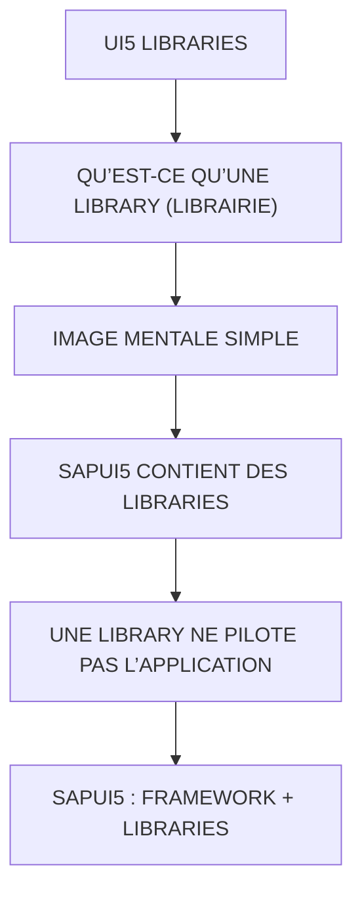

# 🌸 UI5 LIBRARIES

## 🌺 OBJECTIFS

- [ ] Expliquer le rôle de **UI5 LIBRARIES** dans le contexte présenté.
- [ ] Comprendre **qu’est-ce qu’une library (librairie)**.
- [ ] Mettre en œuvre **image mentale simple** dans un exemple guidé.
- [ ] Reconnaître les erreurs fréquentes et les limites de l’approche.
## 🌺 VUE D'ENSEMBLE

> [!IMPORTANT]
> Vérifier la version SAPUI5 ciblée par l’application. La disponibilité d’une API, d’une propriété ou d’un événement peut dépendre de cette version.

## 🌺 QU’EST-CE QU’UNE LIBRARY (LIBRAIRIE)

Une library est un ensemble de fonctions réutilisables que ton code appelle directement.

Définition simple :

     Library = outil
     toi = tu contrôles quand tu l’utilises

## 🌺 IMAGE MENTALE SIMPLE

- Library = boîte à outils
- Framework = machine organisée qui utilise tes outils

## 🌺 SAPUI5 CONTIENT DES LIBRARIES

SAPUI5 est composé de plusieurs libraries UI :

Exemples :

     sap.m → UI mobile (boutons, tables, inputs)
     sap.ui.core → base framework UI5
     sap.ui.layout → layouts
     sap.ui.unified → composants avancés

## 🌺 UNE LIBRARY NE PILOTE PAS L’APPLICATION

Une library :

ne démarre pas ton app
ne gère pas le cycle de vie
ne structure pas ton projet

Elle fait juste des opérations ponctuelles.

## 🌺 SAPUI5 : FRAMEWORK + LIBRARIES

SAPUI5 est un framework construit sur des libraries.

Structure :
Framework UI5 → orchestration (cycle de vie, MVC)
Libraries UI5 → composants réutilisables

## 🌺 RÔLE DES LIBRARIES UI5

Elles fournissent :

     composants UI (Button, Input)
     utilitaires (MessageToast, Formatter)
     modèles (JSONModel)
     helpers (ValueState, BusyIndicator)

## 🌺 POINT IMPORTANT

Une library :

     ne décide pas quand elle est exécutée
     ne gère pas le flux global
     est appelée explicitement

## 🌺 RÉSUMÉ

> - **Qu’est-ce qu’une library (librairie) :** Une library est un ensemble de fonctions réutilisables que ton code appelle directement.
> - Savoir utiliser **image mentale simple** dans le contexte présenté.
> - **Sapui5 contient des libraries :** SAPUI5 est composé de plusieurs libraries UI :

🍧 Afficher l’auto-évaluation

- [ ] Je peux définir **UI5 LIBRARIES** avec mes propres mots.
- [ ] Je peux expliquer **qu’est-ce qu’une library (librairie)** sans relire le chapitre.
- [ ] Je peux appliquer ou illustrer **image mentale simple** dans un exemple simple.
- [ ] Je peux identifier au moins une erreur fréquente ou une limite liée à cette notion.

