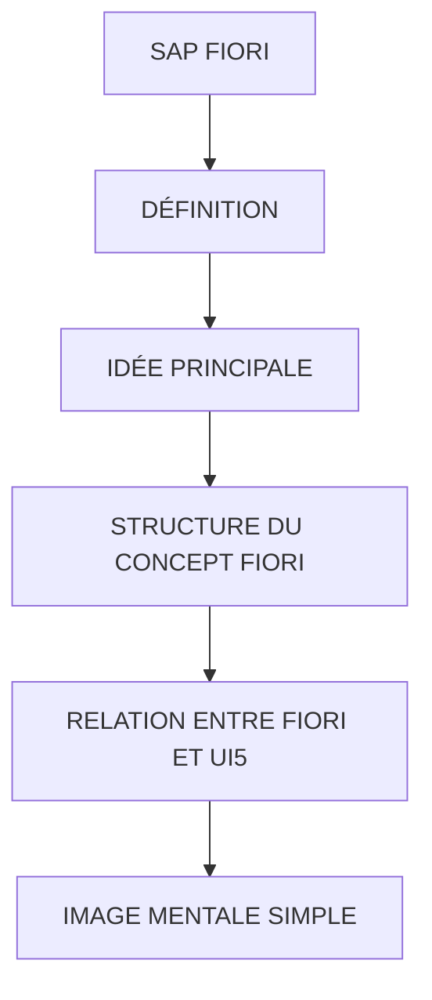

# 🌸 SAP FIORI

## 🌺 OBJECTIFS

- [ ] Expliquer le rôle de **SAP FIORI** dans le contexte présenté.
- [ ] Comprendre **définition**.
- [ ] Mettre en œuvre **idée principale** dans un exemple guidé.
- [ ] Reconnaître les erreurs fréquentes et les limites de l’approche.
## 🌺 VUE D'ENSEMBLE

> [!IMPORTANT]
> Vérifier la version SAPUI5 ciblée par l’application. La disponibilité d’une API, d’une propriété ou d’un événement peut dépendre de cette version.

## 🌺 DÉFINITION

SAP Fiori est un système de conception (design system) et un concept d’UX pour les applications SAP.

Il ne s’agit pas d’un framework technique.

## 🌺 IDÉE PRINCIPALE

SAP Fiori vise à créer des applications :

     simples
     cohérentes
     centrées utilisateur
     accessibles sur tous les devices

## 🌺 STRUCTURE DU CONCEPT FIORI

SAP Fiori repose sur 3 piliers :

1.  Design (UX)

        règles visuelles
        ergonomie
        cohérence des écrans

2.  Applications

        applications métier SAP standard ou custom
        ex : gestion commandes, HR, finance

3.  Technologie

        SAPUI5 (framework technique)

## 🌺 RELATION ENTRE FIORI ET UI5

| Élément   | Rôle                           |
| --------- | ------------------------------ |
| SAP Fiori | concept UX + design            |
| SAPUI5    | framework technique            |
| sap.m     | library UI utilisée pour Fiori |

## 🌺 IMAGE MENTALE SIMPLE

     SAPUI5 = moteur
     SAP Fiori = design + règles d’utilisation du moteur
     Applications Fiori = voitures construites avec ce moteur

## 🌺 PRINCIPES FIORI

SAP Fiori suit des principes clés :

1.  Role-based

        Chaque utilisateur voit uniquement ce dont il a besoin

2.  Simple

        Interface réduite au strict nécessaire

3.  Cohérent

        Même comportement dans toutes les apps

4.  Responsive

        Fonctionne sur :

        desktop
        tablette
        mobile

## 🌺 TYPES D’APPLICATIONS FIORI

1.  Transactional apps

        création / modification de données
        ex : création commande

2.  Analytical apps

        analyse de données
        dashboards KPI

3.  Fact sheets

        consultation d’informations détaillées

## 🌺 EXEMPLE CONCRET

Ancien SAP GUI :

     écrans complexes
     navigation technique
     non responsive

SAP Fiori :

     écran simple
     bouton clair
     logique utilisateur directe

## 🌺 SAP FIORI LAUNCHPAD

Point d’entrée des applications Fiori :

     tableau de tuiles (tiles)
     navigation vers apps
     gestion rôles utilisateurs

## 🌺 RÔLE DE SAPUI5 DANS FIORI

SAPUI5 sert à :

     construire les interfaces Fiori
     gérer binding et data
     gérer navigation
     gérer interaction utilisateur

## 🌺 POINT IMPORTANT

SAP Fiori ≠ technologie

C’est :

     une expérience utilisateur
     un standard de design
     une manière de construire des apps SAP

## 🌺 RÉSUMÉ

> - **Définition :** SAP Fiori est un système de conception (design system) et un concept d’UX pour les applications SAP.
> - **Idée principale :** SAP Fiori vise à créer des applications :
> - **Structure du concept fiori :** SAP Fiori repose sur 3 piliers :

🍧 Afficher l’auto-évaluation

- [ ] Je peux définir **SAP FIORI** avec mes propres mots.
- [ ] Je peux expliquer **définition** sans relire le chapitre.
- [ ] Je peux appliquer ou illustrer **idée principale** dans un exemple simple.
- [ ] Je peux identifier au moins une erreur fréquente ou une limite liée à cette notion.

