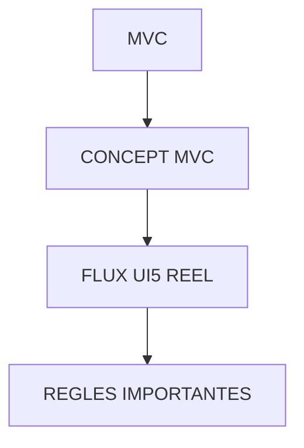

# 🌸 MVC

## 🌺 OBJECTIFS

- [ ] Expliquer le rôle de **MVC** dans le contexte présenté.
- [ ] Comprendre **concept mvc**.
- [ ] Mettre en œuvre **flux ui5 reel** dans un exemple guidé.
- [ ] Reconnaître les erreurs fréquentes et les limites de l’approche.

## 🌺 VUE D'ENSEMBLE



## 🌺 CONCEPT MVC

`MVC` = `Model` <–> `View` <–> `Controller`

C’est une architecture qui sépare une application en 3 parties :

- Model : données
- View : interface utilisateur
- Controller : logique

### 🍧 POURQUOI UTILISER MVC EN UI5 ?

Sans `MVC` :

- code mélangé
- maintenance difficile
- erreurs fréquentes
- logique dispersée

Avec `MVC` :

- séparation claire
- code maintenable
- réutilisable
- testable

### 🍧 3 COMPOSANTS DU MVC

#### 💮 MODEL (M)

Rôle :

     Contient les données uniquement.

Types en UI5 :

     ODataModel (SAP)
     JSONModel (local)

Exemple :

```js
var OData = {
  IdSession: "S001", // Clé technique de la session côté backend SAP (identifiant fonctionnel)
  IdConsultant: "C001", // Clé technique du consultant (identifiant unique dans la session)
  Entreprise: "SAP",
  Name: "Martin",
  DateBirth: "\/Date(631152000000)\/", // Date de naissance au format OData V2 (format spécifique : /Date(<timestamp en millisecondes>)/)
  City: "Paris",
  Region: "IDF",
  Country: "FR",
  Lang: "FR",
};
```

Règles :

- ne contient pas de logique UI
- ne gère pas l’affichage
- source de données unique

#### 💮 VIEW (V)

Rôle :

     Affichage de l’interface utilisateur.

Exemple XML UI5 :

```xml
<Text text="{/Name}" />
```

Contenu typique :

- Table
- Input
- Button
- Text

Règles :

- aucune logique métier
- uniquement affichage + binding
- déclenche des événements

#### 💮 CONTROLLER (C)

Rôle :

     Logique de l’application.

Exemple :

```js
onPress: function () {
    console.log("Click OK");
}
```

Responsabilités :

- gérer les événements
- appeler le Model
- traiter les données
- mettre à jour la View

## 🌺 FLUX UI5 REEL

     Utilisateur
     ↓
     View (clic / interaction)
     ↓
     Controller (logique)
     ↓
     Model (données)
     ↓
     Controller (traitement)
     ↓
     View (affichage mis à jour)

> [!WARNING]
> UI5 n’est pas une boucle stricte : les interactions sont déclenchées par événements + binding.

## 🌺 REGLES IMPORTANTES

- Le Model contient les données uniquement
- La View affiche uniquement les données
- Le Controller contient toute la logique
- Pas de logique métier dans XML
- Le Model est la source de vérité

## 🌺 RÉSUMÉ

> - **Concept mvc :** C’est une architecture qui sépare une application en 3 parties :
> - **Flux ui5 reel :** View (clic / interaction)
> - Savoir utiliser **regles importantes** dans le contexte présenté.

<details>
<summary>🍧 Afficher l’auto-évaluation</summary>

- [ ] Je peux définir **MVC** avec mes propres mots.
- [ ] Je peux expliquer **concept mvc** sans relire le chapitre.
- [ ] Je peux appliquer ou illustrer **flux ui5 reel** dans un exemple simple.
- [ ] Je peux identifier au moins une erreur fréquente ou une limite liée à cette notion.

</details>
