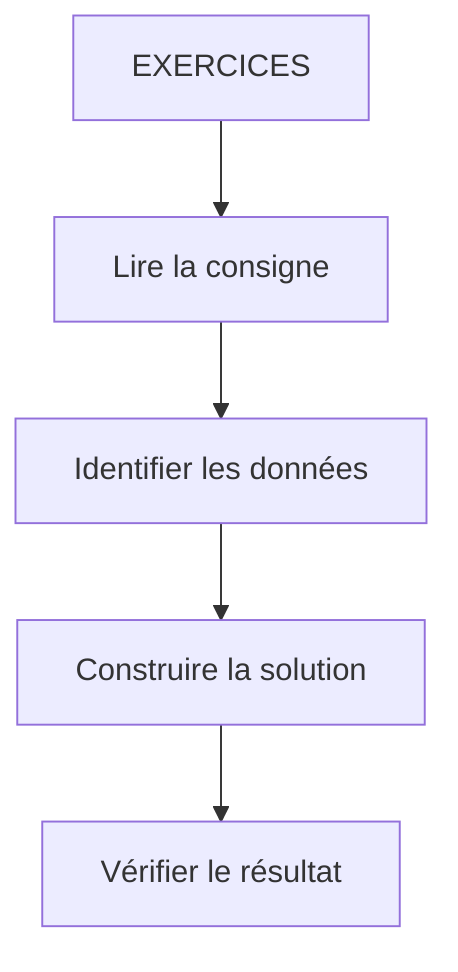

# 🌸 EXERCICES

## 🌺 OBJECTIFS

- [ ] Analyser la consigne et identifier les données utiles.
- [ ] Construire une solution sans consulter la correction.
- [ ] Vérifier le résultat et les cas limites.
- [ ] Justifier les choix techniques retenus.
## 🌺 VUE D'ENSEMBLE

> [!IMPORTANT]
> Réaliser l’exercice sans ouvrir la correction. Vérifier ensuite le résultat, les cas limites et la lisibilité de la solution.

## 🌺 EXERCICE 1 - IDENTIFIER LE MVC

### 🍧 Énoncé

Dans une application simple de gestion de profil utilisateur, classer les éléments suivants en déterminant s'ils correspondent aux Models, aux Views ou aux Controllers:

- Formulaire HTML avec champs (nom, prénom, âge)
- Objet utilisateur contenant les données
- Clic sur bouton "Sauvegarder"
- Fonction qui met à jour le prénom
- Affichage des données à l’écran

## 🌺 EXERCICE 2 - CONSTRUIRE LA LOGIQUE MVC

### 🍧 Énoncé

Toujours dans le cadre du formulaire, organiser l'ordre logique des éléments suivants en MVC :

- CONTROLLER → Envoie les données du MODEL au BACKEND
- VIEW → Affiche les composants du formulaire
- CONTROLLER → met à jour VIEW
- MODEL → stocke les données
- VIEW → Affiche les résultats
- CONTROLLER → Récupère les données du BACKEND
- CONTROLLER → modifie MODEL
- VIEW → est déclenché par une action (click)

## 🌺 RÉSUMÉ

> - **Exercice 1 - identifier le mvc :** Dans une application simple de gestion de profil utilisateur, classer les éléments suivants en déterminant s'ils correspondent aux Models, aux Views ou aux Controllers:
> - **Exercice 2 - construire la logique mvc :** Toujours dans le cadre du formulaire, organiser l'ordre logique des éléments suivants en MVC :

🍧 Afficher l’auto-évaluation

- [ ] Je peux définir **EXERCICES** avec mes propres mots.
- [ ] Je peux expliquer **exercice 1 - identifier le mvc** sans relire le chapitre.
- [ ] Je peux appliquer ou illustrer **exercice 2 - construire la logique mvc** dans un exemple simple.
- [ ] Je peux identifier au moins une erreur fréquente ou une limite liée à cette notion.

