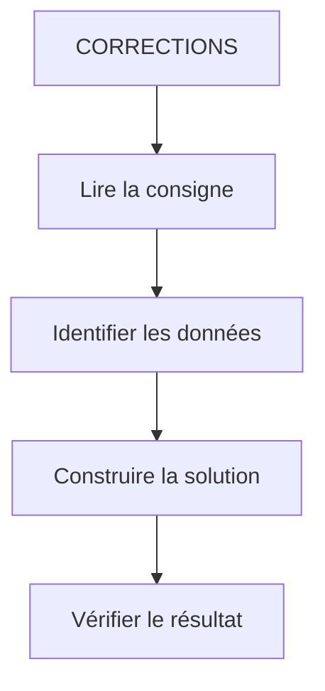

# 🌸 CORRECTIONS

## 🌺 OBJECTIFS

- [ ] Expliquer le rôle de **CORRECTIONS** dans le contexte présenté.
- [ ] Comprendre **exercice 1 - identifier le mvc**.
- [ ] Mettre en œuvre **exercice 2 - construire la logique mvc** dans un exemple guidé.
- [ ] Reconnaître les erreurs fréquentes et les limites de l’approche.

## 🌺 VUE D'ENSEMBLE

> [!NOTE]
> Comparer la correction avec la démarche suivie avant de recopier le code. Une solution différente peut être valide si elle respecte la consigne et les contraintes techniques.

## 🌺 EXERCICE 1 - IDENTIFIER LE MVC

#### 💮 Énoncé

Dans une application simple de gestion de profil utilisateur, classer les éléments suivants en déterminant s'ils correspondent aux Models, aux Views ou aux Controllers:

- Formulaire HTML avec champs (nom, prénom, âge)
- Objet utilisateur contenant les données
- Clic sur bouton "Sauvegarder"
- Fonction qui met à jour le prénom
- Affichage des données à l’écran

#### 💮 Correction

| Élément                 | MVC          |
| ----------------------- | ------------ |
| Formulaire HTML         | `View`       |
| Objet utilisateur       | `Model`      |
| Clic sur bouton         | `View`       |
| Fonction de mise à jour | `Controller` |
| Affichage des données   | `View`       |

#### 💮 Explication

La `View` déclenche des actions
Le `Controller` traite la logique
Le `Model` contient les données
La `View` n’a pas le droit de modifier directement les données

## 🌺 EXERCICE 2 - CONSTRUIRE LA LOGIQUE MVC

### 🍧 Énoncé

Toujours dans le cadre du formulaire, organiser l'ordre logique des éléments suivants en MVC :

- CONTROLLER → Envoie les données du MODEL au BACKEND
- VIEW → Affiche les composants du formulaire
- CONTROLLER → met à jour VIEW
- MODEL → stocke les données
- VIEW → Affiche les résultats
- CONTROLLER → Récupère les données du BACKEND
- CONTROLLER → modifie MODEL
- VIEW → est déclenché par une action (click)

#### 💮 Correction

     VIEW → Affiche les composants du formulaire
     ↓
     VIEW → déclenche une action (click)
     ↓
     CONTROLLER → modifie MODEL
     ↓
     MODEL → stocke les données
     ↓
     CONTROLLER → Envoie les données du MODEL au BACKEND
     ↓
     CONTROLLER → Récupère les données du BACKEND
     ↓
     CONTROLLER → met à jour VIEW
     ↓
     VIEW → Affiche les résultats

#### 💮 Explication

- Le Model stocke les données
- La View affiche le Model
- Le Controller modifie uniquement le Model

## 🌺 RÉSUMÉ

> - **Exercice 1 - identifier le mvc :** Dans une application simple de gestion de profil utilisateur, classer les éléments suivants en déterminant s'ils correspondent aux Models, aux Views ou aux Controllers:
> - **Exercice 2 - construire la logique mvc :** Toujours dans le cadre du formulaire, organiser l'ordre logique des éléments suivants en MVC :

🍧 Afficher l’auto-évaluation

- [ ] Je peux définir **CORRECTIONS** avec mes propres mots.
- [ ] Je peux expliquer **exercice 1 - identifier le mvc** sans relire le chapitre.
- [ ] Je peux appliquer ou illustrer **exercice 2 - construire la logique mvc** dans un exemple simple.
- [ ] Je peux identifier au moins une erreur fréquente ou une limite liée à cette notion.

