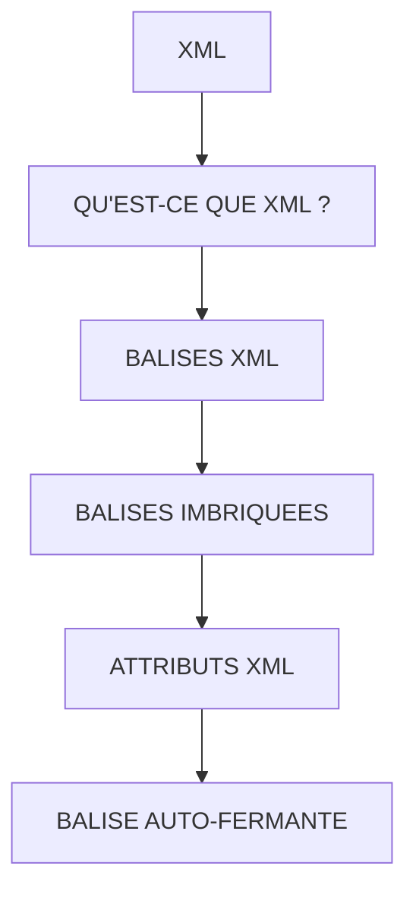

# 🌸 XML

## 🌺 OBJECTIFS

- [ ] Expliquer le rôle de **XML** dans le contexte présenté.
- [ ] Comprendre **qu'est-ce que xml ?**.
- [ ] Mettre en œuvre **balises xml** dans un exemple guidé.
- [ ] Reconnaître les erreurs fréquentes et les limites de l’approche.

## 🌺 VUE D'ENSEMBLE



## 🌺 QU'EST-CE QUE XML ?

XML signifie :

    eXtensible Markup Language

- XML est un langage utilisé pour organiser des informations dans une structure lisible.
- XML ne réalise aucun traitement.
- XML sert uniquement à décrire une structure.

Exemple :

```xml
<Personne>
    <Nom>Martin</Nom>
    <Ville>Paris</Ville>
</Personne>
```

Signification :

    Personne
        ├── Nom : Martin
        └── Ville : Paris

## 🌺 BALISES XML

Un élément XML est appelé une balise.

Exemple :

```xml
<Nom>Martin</Nom>
```

Décomposition :

    <Nom>
        ouverture de la balise

    "Martin"
        contenu

    </Nom>
        fermeture

## 🌺 BALISES IMBRIQUEES

Une balise peut contenir d'autres balises.

Exemple :

```xml
<Personne>
    <Nom>Martin</Nom>
    <Ville>Paris</Ville>
</Personne>
```

Structure :

    Personne
        ├── Nom
        └── Ville

La balise `Personne` est le parent.

`Nom` et `Ville` sont des enfants.

## 🌺 ATTRIBUTS XML

Une balise peut posséder des attributs.

Les attributs ajoutent des informations supplémentaires.

Exemple :

```xml
<Personne age="25">
    <Nom>Martin</Nom>
</Personne>
```

Ici :

    age
    ↓
    25

## 🌺 BALISE AUTO-FERMANTE

Certaines balises n'ont pas de contenu.

Écriture :

```xml
<Input />
```

Equivalent :

```xml
<Input></Input>
```

UI5 utilise souvent cette écriture courte.

## 🌺 RÈGLES XML IMPORTANTES

#### 💮 Fermeture

Une balise ouverte doit être fermée

✔ Correct :

```xml
<Text>Bonjour</Text>
```

❌ Faux :

```xml
<Text>Bonjour
```

#### 💮 Imbrication

Respecter l'imbrication

✔ Correct :

```xml
<Page>
    <content>
        <Text text="Bonjour"/>
    </content>
</Page>
```

❌ Faux :

```xml
<Page>
    <content>
</Page>
</content>
```

#### 💮 Casse

UI5 est sensible à la casse.

✔ Correct :

```xml
<Button />
```

❌ Faux :

```
<button />
```

## 🌺 XML DANS SAPUI5

Dans UI5, les balises XML représentent des composants.

Exemple :

```xml
<Button
    text="Valider"
/>
```

Interprétation :

    Button
    ↓
    Composant UI5

    text
    ↓
    propriété

    Valider
    ↓
    valeur

## 🌺 EXEMPLE UI5 COMPLET

```xml
<mvc:View
    controllerName="fr.stms.fgifirstappmodulename.controller.Home"
    xmlns:mvc="sap.ui.core.mvc"
    xmlns="sap.m"
>
    <Page
        id="page"
        title="{i18n>title}"
    >
        <Text text="Bienvenue" />
        <Button text="Valider" />
    </Page>
</mvc:View>
```

Structure :

    Personne
        ├── Text
        └── Button

## 🌺 A RETENIR

- XML décrit une structure
- Une balise possède une ouverture et fermeture
- Une balise peut contenir d'autres balises
- Une balise peut posséder des attributs
- UI5 transforme les balises XML en composants visuels

> [!TIP]
> Dans une View UI5 :
>
> - Balise XML = composant UI5
> - Attribut = propriété

## 🌺 RÉSUMÉ

> - **Qu'est-ce que xml ? :** eXtensible Markup Language
> - **Balises xml :** Un élément XML est appelé une balise.
> - **Balises imbriquees :** Une balise peut contenir d'autres balises.

<details>
<summary>🍧 Afficher l’auto-évaluation</summary>

- [ ] Je peux définir **XML** avec mes propres mots.
- [ ] Je peux expliquer **qu'est-ce que xml ?** sans relire le chapitre.
- [ ] Je peux appliquer ou illustrer **balises xml** dans un exemple simple.
- [ ] Je peux identifier au moins une erreur fréquente ou une limite liée à cette notion.

</details>
