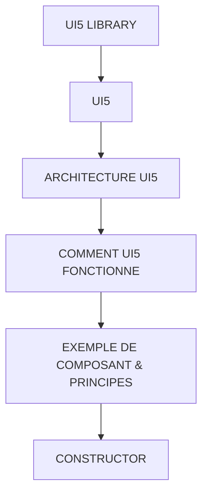

# 🌸 UI5 LIBRARY

## 🌺 OBJECTIFS

- [ ] Expliquer le rôle de **UI5 LIBRARY** dans le contexte présenté.
- [ ] Comprendre **ui5**.
- [ ] Mettre en œuvre **architecture ui5** dans un exemple guidé.
- [ ] Reconnaître les erreurs fréquentes et les limites de l’approche.

## 🌺 VUE D'ENSEMBLE



> [!IMPORTANT]
> Vérifier la version SAPUI5 ciblée par l’application. La disponibilité d’une API, d’une propriété ou d’un événement peut dépendre de cette version.

## 🌺 UI5

UI5 signifie :

    User Interface for HTML5

UI5 est un framework JavaScript SAP permettant de créer des applications web structurées selon MVC.

Une UI5 Library est un ensemble de classes UI5 regroupées par domaine fonctionnel.

Elle contient :

- controls (UI)
- models (données)
- types (formatage / validation)
- utilitaires
- infrastructure interne

Exemples de libraries :

| Library       | Rôle                         |
| ------------- | ---------------------------- |
| sap.m         | UI Fiori (mobile + standard) |
| sap.ui.core   | base framework               |
| sap.ui.table  | tables avancées              |
| sap.f         | floorplans Fiori             |
| sap.ui.layout | layout UI                    |

## 🌺 ARCHITECTURE UI5

    Utilisateur
    ↓
    View (UI5 Controls)
    ↓
    Controller
    ↓
    Model (OData / JSON)
    ↓
    Backend (SAP / MockServer)

## 🌺 COMMENT UI5 FONCTIONNE

UI5 ne fonctionne pas comme du JavaScript classique :

    Le framework construit automatiquement les objets à partir de la View XML.
    Autrement dit, le développeur décrit, UI5 exécute.

## 🌺 EXEMPLE DE COMPOSANT & PRINCIPES

[sap.m.Button](https://sapui5.netweaver.ondemand.com/#/api/sap.m.Button)

UI5 fonctionne sur 3 mécanismes principaux :

#### 💮 1. Instanciation automatique

UI5 crée les composants déclarés en XML.

```xml
<Button text="Valider" />
```

UI5 fait en interne :

```js
new sap.m.Button(...)
```

#### 💮 2. Binding (mécanisme central)

```xml
<Text text="{Name}" />
```

UI5 :

- lit le model
- récupère la propriété
- met à jour la UI automatiquement

#### 💮 3. Events

```xml
<Button text="OK" press="onPress" />
```

UI5 :

→ déclenche une méthode dans le Controller.

## 🌺 CONSTRUCTOR

Le constructor est la méthode appelée lors de l’instanciation d’un composant UI5.

Mais en application Fiori :

    Le développeur ne l’utilise presque jamais directement !

Instanciation interne UI5 :

```js
new sap.m.Button({
  text: "OK",
});
```

Mais en Fiori (réellement et uniquement nécessaire) :

```xml
<Button text="OK" />
```

## 🌺 PROPERTIES

Les properties sont des valeurs simples :

- text
- visible
- enabled
- ...

```xml
<Button text="Valider" enabled="true" />
```

## 🌺 AGGREGATIONS

Une aggregation contient des éléments UI.

```xml
<Page>
  <content>
    <Text text="Hello" />
  </content>
</Page>
```

## 🌺 ASSOCIATIONS

Les associations sont des liens faibles basés sur ID.

```xml
<Label text="Nom" labelFor="inputName" />
<Input id="inputName" />
```

➡ pas de nesting
➡ pas de parent-child structure

## 🌺 EVENTS

Les events représentent les actions utilisateur.

```xml
<Button press="onValidate" />
```

Controller :

```js
/**
 * onValidate
 * ---------------------------------------------------------------------------
 * Méthode du contrôleur SAPUI5.
 *
 * Généralement déclenchée par une action utilisateur :
 * - clic sur un bouton (ex: "Valider")
 * - event handler défini dans la View XML
 *
 * Exemple dans XML :
 * <Button text="Valider" press=".onValidate" />
 *
 * ---------------------------------------------------------------------------
 * Rôle :
 * Contient la logique métier liée à la validation.
 * (contrôles, appels service, transformations, etc.)
 * ---------------------------------------------------------------------------
 */
onValidate: function () {

    /**********************************************************************
     * Zone de logique métier
     *
     * Ici peuvent être placés :
     * - validations de champs (Input, Form, etc.)
     * - appels OData / DataServices
     * - gestion d’état UI (Busy, enabled/disabled)
     * - navigation router
     **********************************************************************/

    // logique métier
}
```

## 🌺 POINT TRÈS IMPORTANT

UI5 fonctionne en mode déclaratif

- View = description
- Controller = logique
- Model = données

UI5 fait le reste automatiquement.

🧩 RECAPITULATIF

| Élément     | Rôle réel                                          |
| ----------- | -------------------------------------------------- |
| Library     | ensemble de classes UI5 (UI + model + utilitaires) |
| Constructor | instanciation automatique UI5                      |
| Property    | état d’un composant                                |
| Aggregation | contenu d’un composant                             |
| Association | lien par ID                                        |
| Event       | interaction utilisateur                            |

## 🌺 RÉSUMÉ

> - **Ui5 :** User Interface for HTML5
> - **Architecture ui5 :** Backend (SAP / MockServer)
> - **Comment ui5 fonctionne :** UI5 ne fonctionne pas comme du JavaScript classique :

<details>
<summary>🍧 Afficher l’auto-évaluation</summary>

- [ ] Je peux définir **UI5 LIBRARY** avec mes propres mots.
- [ ] Je peux expliquer **ui5** sans relire le chapitre.
- [ ] Je peux appliquer ou illustrer **architecture ui5** dans un exemple simple.
- [ ] Je peux identifier au moins une erreur fréquente ou une limite liée à cette notion.

</details>
