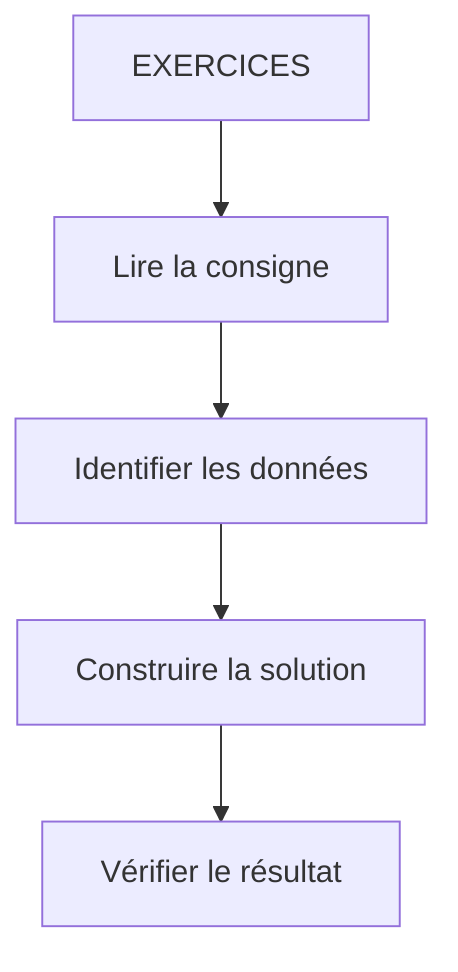

# 🌸 EXERCICES

## 🌺 OBJECTIFS

- [ ] Analyser la consigne et identifier les données utiles.
- [ ] Construire une solution sans consulter la correction.
- [ ] Vérifier le résultat et les cas limites.
- [ ] Justifier les choix techniques retenus.
## 🌺 VUE D'ENSEMBLE




## 🌺 EXERCICE 1 - COMPRENDRE UNE PROPERTY

### 🍧 Énoncé

Home.view.xml

     webapp/view/Home.view.xml

Créer 1 bouton avec les 4 Properties :

     texte     = "Valider"
     Bouton    = <désactivé>
     largeur   = <200px>
     Type      = "Accept"

- [sap.m.Button - Class](https://sapui5.netweaver.ondemand.com/#/api/sap.m.Button%23overview)
- [sap.m.Button - Samples](https://sapui5.netweaver.ondemand.com/#/entity/sap.m.Button)

## 🌺 EXERCICE 2 - COMPRENDRE UN EVENT

### 🍧 Énoncé

Home.view.xml

     webapp/view/Home.view.xml

1. Ajouter l'Event press en lui assignant la fonction `onPress`.

2. "Activer" le Button.

3. Ajouter la fonction `onPress` dans le Home.controller.js (webapp/controller/Home.controller.js) :

```js
sap.ui.define(["sap/ui/core/mvc/Controller"], (Controller) => {
  "use strict";

  return Controller.extend("fr.stms.fgifirstappmodulename.controller.Home", {
    onInit: function () {},

    onPress: function (oEvent) {
      console.log("Bouton pressé");
    },
  });
});
```

> [!CAUTION]
> Remplacer `fgifirstappmodulename` par le namespace de votre application !

## 🌺 EXERCICE 3 - COMPRENDRE UNE ASSOCIATION

### 🍧 Énoncé

Home.view.xml

     webapp/view/Home.view.xml

1. Associer Label et Input

Relier :

```xml
<Label text="Nom" />
```

avec

```xml
<Input id="inputName"/>
```

- [sap.m.Input - Class](https://sapui5.netweaver.ondemand.com/#/api/sap.m.Input)
- [sap.m.Input - Samples](https://sapui5.netweaver.ondemand.com/#/entity/sap.m.Input)

## 🌺 EXERCICE 4 - COMPRENDRE UNE AGGREGATION

### 🍧 Énoncé

Home.view.xml

     webapp/view/Home.view.xml

1. Ajouter un footer au composant sap.m.Page

- [sap.m.Page - Class](https://sapui5.netweaver.ondemand.com/#/api/sap.m.Page%23aggregations)
- [sap.m.Page - Samples](https://sapui5.netweaver.ondemand.com/#/entity/sap.m.Page)

2. Déplacer le bouton dans le footer

3. Positionner le bouton à droite dans le footer

## 🌺 RÉSUMÉ

> - **Exercice 1 - comprendre une property :** webapp/view/Home.view.xml
> - **Exercice 2 - comprendre un event :** webapp/view/Home.view.xml
> - **Exercice 3 - comprendre une association :** webapp/view/Home.view.xml

<details>
<summary>🍧 Afficher l’auto-évaluation</summary>

- [ ] Je peux définir **EXERCICES** avec mes propres mots.
- [ ] Je peux expliquer **exercice 1 - comprendre une property** sans relire le chapitre.
- [ ] Je peux appliquer ou illustrer **exercice 2 - comprendre un event** dans un exemple simple.
- [ ] Je peux identifier au moins une erreur fréquente ou une limite liée à cette notion.

</details>
