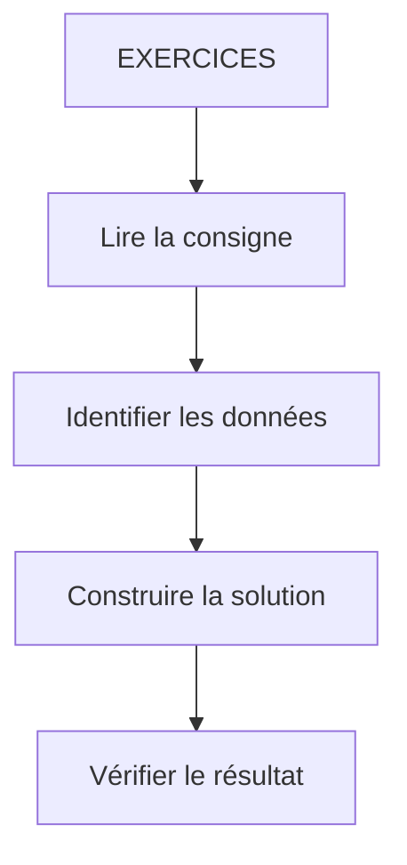

# 🌸 EXERCICES

## 🌺 OBJECTIFS

- [ ] Analyser la consigne et identifier les données utiles.
- [ ] Construire une solution sans consulter la correction.
- [ ] Vérifier le résultat et les cas limites.
- [ ] Justifier les choix techniques retenus.

## 🌺 VUE D'ENSEMBLE



> [!IMPORTANT]
> Réaliser l’exercice sans ouvrir la correction. Vérifier ensuite le résultat, les cas limites et la lisibilité de la solution.

## 🌺 EXERCICE 1 - AJOUTER DES MARGES

### 🍧 Énoncé

Énoncé :

Ajouter une marge responsive :

```xml
<Button text="Valider"/>
```

### 🍧 Correction :

```xml
<Button
    text="Valider"
    class="sapUiResponsiveMargin"/>
```

## 🌺 EXERCICE 2 - FLEXBOX

[Flexbox](https://flexboxfroggy.com/#fr)

## 🌺 EXERCICE 3 - RESPONSIVE

### 🍧 Énoncé

Dans :

```xml
<Button
    text="Valider"
    class="sapUiHideOnMobile"/>
```

Identifier :

     composant
     property
     classe CSS

### 🍧 Correction :

     Composant : Button
     Property : text
     Classe CSS : sapUiHideOnMobile

## 🌺 RÉSUMÉ

> - **Exercice 1 - ajouter des marges :** Ajouter une marge responsive :
> - Savoir utiliser **exercice 2 - flexbox** dans le contexte présenté.
> - **Exercice 3 - responsive :** Classe CSS : sapUiHideOnMobile

<details>
<summary>🍧 Afficher l’auto-évaluation</summary>

- [ ] Je peux définir **EXERCICES** avec mes propres mots.
- [ ] Je peux expliquer **exercice 1 - ajouter des marges** sans relire le chapitre.
- [ ] Je peux appliquer ou illustrer **exercice 2 - flexbox** dans un exemple simple.
- [ ] Je peux identifier au moins une erreur fréquente ou une limite liée à cette notion.

</details>
