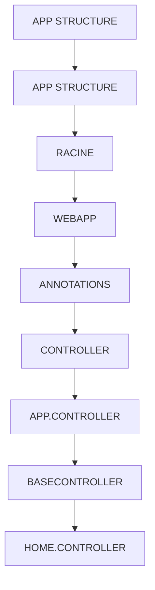

# 🌸 SOMMAIRE — APP STRUCTURE

## 🌺 OBJECTIFS DU COURS

- [ ] Comprendre la progression générale du cours.
- [ ] Identifier l’ordre conseillé des chapitres.
- [ ] Retrouver rapidement une notion précise.

## 🌺 PARCOURS

> [!IMPORTANT]
> Suivre les chapitres dans l’ordre numérique, sauf révision ciblée d’une notion déjà étudiée.

## 🌺 CHAPITRES

- [APP STRUCTURE](<./01 - 🍧 APP STRUCTURE.md>)
- [RACINE](<./02 - 🍧 RACINE.md>)
- [WEBAPP](<./03 - 🍧 WEBAPP.md>)
- [ANNOTATIONS](<./04 - 🍧 ANNOTATIONS.md>)
- [CONTROLLER](<./05 - 🍧 CONTROLLER.md>)
- [APP.CONTROLLER](<./06 - 🍧 APP.CONTROLLER.md>)
- [BASECONTROLLER](<./07 - 🍧 BASECONTROLLER.md>)
- [HOME.CONTROLLER](<./08 - 🍧 HOME.CONTROLLER.md>)
- [DETAILS.CONTROLLER](<./09 - 🍧 DETAILS.CONTROLLER.md>)
- [CSS](<./10 - 🍧 CSS.md>)
- [I18N](<./11 - 🍧 I18N.md>)
- [LIBS](<./12 - 🍧 LIBS.md>)
- [DATASERVICES](<./13 - 🍧 DATASERVICES.md>)
- [FORMATTER](<./14 - 🍧 FORMATTER.md>)
- [LOCALSERVICE & METADATA](<./15 - 🍧 LOCALSERVICE & METADATA.md>)
- [MODELS](<./16 - 🍧 MODELS.md>)
- [VIEWS](<./17 - 🍧 VIEWS.md>)
- [APP.VIEW](<./18 - 🍧 APP.VIEW.md>)
- [HOME.VIEW](<./19 - 🍧 HOME.VIEW.md>)
- [DETAILS.VIEW](<./20 - 🍧 DETAILS.VIEW.md>)
- [FRAGMENTS](<./21 - 🍧 FRAGMENTS.md>)
- [COMPONENTS](<./22 - 🍧 COMPONENTS.md>)
- [INDEX.HTML](<./23 - 🍧 INDEX.HTML.md>)
- [MANIFEST](<./24 - 🍧 MANIFEST.md>)
- [GITIGNORE](<./25 - 🍧 GITIGNORE.md>)
- [PACKAGE-LOCK](<./26 - 🍧 PACKAGE-LOCK.md>)
- [UI5-LOCAL](<./27 - 🍧 UI5-LOCAL.md>)
- [UI5-MOCK](<./28 - 🍧 UI5-MOCK.md>)
- [UI5.YAML](<./29 - 🍧 UI5.YAML.md>)

Afficher la méthode de travail

1. Lire les objectifs du chapitre.
2. Étudier le schéma Mermaid.
3. Reproduire les exemples.
4. Réaliser l’exercice sans consulter la correction.
5. Valider l’auto-évaluation.

## 🌺 RÉSUMÉ

> - Ce sommaire représente le parcours du cours **APP STRUCTURE**.
> - Les liens pointent vers les chapitres conservés dans leur emplacement d’origine.
