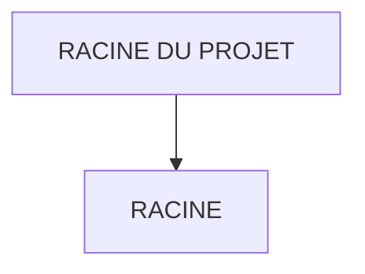

# 🌸 RACINE DU PROJET

## 🌺 OBJECTIFS

- [ ] Expliquer le rôle de **RACINE DU PROJET** dans le contexte présenté.
- [ ] Comprendre **racine**.
- [ ] Appliquer la notion dans un exemple simple.
- [ ] Reconnaître les erreurs fréquentes et les limites de l’approche.

## 🌺 VUE D'ENSEMBLE



## 🌺 RACINE

```
fgifirstappmodulename/ # <- Racine du projet
```

> [!IMPORTANT]
>
> - 🎯 Objectif
>   Contenir tout le projet UI5/Fiori :
>   - code,
>   - configuration,
>   - preview,
>   - build.
> - 🔨 Utilité : C’est le dossier que tu ouvres dans SAP Business Application Studio ou VSCode.
> - ⌚ Quand utilisé ? Toujours : c’est le point de départ.

📌 Exemple :

     Quand vous faites npm start, la commande est exécutée depuis cette racine.

### 🍧 CONTENU ATTENDU

| Élément | Rôle |
| --- | --- |
| `package.json` | Scripts et dépendances Node.js du projet |
| `ui5.yaml` | Configuration de UI5 Tooling |
| `webapp/` | Sources exécutées ou servies au navigateur |
| `.gitignore` | Fichiers locaux exclus du versionnement |
| `README.md` | Commandes, prérequis et conventions propres au projet |

Le nom du dossier racine n'est pas le namespace UI5. Le namespace est défini dans la configuration de l'application et doit rester cohérent avec `Component.js`, `manifest.json` et les chemins de modules.

### 🍧 VÉRIFICATION

Depuis la racine, exécuter `npm install`, puis le script déclaré dans `package.json`, généralement `npm start`. Une commande lancée depuis `webapp/` peut échouer parce que `package.json` et `ui5.yaml` se trouvent au niveau supérieur.

## 🌺 RÉSUMÉ

> - **Racine :** Quand vous faites npm start, la commande est exécutée depuis cette racine.
> - Elle contient la configuration du projet ; le code applicatif se trouve principalement dans `webapp/`.

<details>
<summary>🍧 Afficher l’auto-évaluation</summary>

- [ ] Je peux définir **RACINE DU PROJET** avec mes propres mots.
- [ ] Je peux expliquer **racine** sans relire le chapitre.
- [ ] Je peux appliquer ou illustrer **un exemple concret** dans un exemple simple.
- [ ] Je peux identifier au moins une erreur fréquente ou une limite liée à cette notion.

</details>
