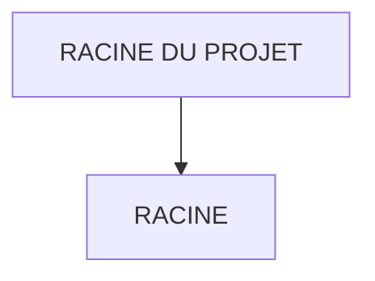

# 🌸 RACINE DU PROJET

## 🌺 OBJECTIFS

- [ ] Expliquer le rôle de **RACINE DU PROJET** dans le contexte présenté.
- [ ] Comprendre **racine**.
- [ ] Appliquer la notion dans un exemple simple.
- [ ] Reconnaître les erreurs fréquentes et les limites de l’approche.

## 🌺 VUE D'ENSEMBLE



## 🌺 RACINE

```
fgifirstappmodulename/ # <- Racine du projet
```

> [!IMPORTANT]
>
> - 🎯 Objectif
>   Contenir tout le projet UI5/Fiori :
>   - code,
>   - configuration,
>   - preview,
>   - build.
> - 🔨 Utilité : C’est le dossier que tu ouvres dans SAP Business Application Studio ou VSCode.
> - ⌚ Quand utilisé ? Toujours : c’est le point de départ.

📌 Exemple :

     Quand vous faites npm start, la commande est exécutée depuis cette racine.

## 🌺 RÉSUMÉ

> - **Racine :** Quand vous faites npm start, la commande est exécutée depuis cette racine.

<details>
<summary>🍧 Afficher l’auto-évaluation</summary>

- [ ] Je peux définir **RACINE DU PROJET** avec mes propres mots.
- [ ] Je peux expliquer **racine** sans relire le chapitre.
- [ ] Je peux appliquer ou illustrer **un exemple concret** dans un exemple simple.
- [ ] Je peux identifier au moins une erreur fréquente ou une limite liée à cette notion.

</details>
