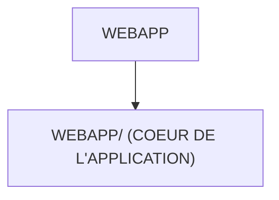

# 🌸 WEBAPP

## 🌺 OBJECTIFS

- [ ] Expliquer le rôle de **WEBAPP** dans le contexte présenté.
- [ ] Comprendre **webapp/ (coeur de l'application)**.
- [ ] Appliquer la notion dans un exemple simple.
- [ ] Reconnaître les erreurs fréquentes et les limites de l’approche.

## 🌺 VUE D'ENSEMBLE



## 🌺 WEBAPP/ (COEUR DE L'APPLICATION)

```
fgifirstappmodulename/
└── webapp/ # <- Contenu principal de l'application Fiori
```

> [!IMPORTANT]
>
> - 🎯 Objectif
>   Contenir tout ce qui est exécuté dans le navigateur.
> - 🔨 Utilité : UI5 charge exclusivement ce dossier pour afficher l’application.
> - ⌚ Quand utilisé ? À chaque fois que l’app démarre.

📌 Exemple :

     Les vues XML, les controllers JS et le manifest sont tous ici.

### 🍧 CONTENU ET FRONTIÈRE

`webapp/` contient les ressources de l'application : `manifest.json`, `Component.js`, vues, contrôleurs, modèles, traductions, styles et ressources locales. Les fichiers nécessaires uniquement au développement, comme `package.json` et `ui5.yaml`, restent à la racine.

Le dossier peut aussi contenir `test/`. Le code productif ne doit pas importer une ressource de `test/`, car cette ressource peut être exclue du build de production.

### 🍧 VÉRIFICATION

- `webapp/manifest.json` existe et contient un JSON valide.
- Le namespace des contrôleurs et vues correspond à celui de l'application.
- Les chemins déclarés dans `manifest.json` respectent la casse des fichiers.
- Les ressources chargées par le navigateur ne produisent pas de `404` dans les outils de développement.

Source : SAP SE, *Folder Structure: Where to Put Your Files*, documentation SAPUI5, consultée le 4 août 2026 : https://ui5.sap.com/1.38.65/docs/guide/003f755d46d34dd1bbce9ffe08c8d46a.html

## 🌺 RÉSUMÉ

> - **Webapp/ (coeur de l'application) :** Les vues XML, les controllers JS et le manifest sont tous ici.
> - Les outils de build utilisent la racine ; l'application servie au navigateur provient principalement de `webapp/`.

<details>
<summary>🍧 Afficher l’auto-évaluation</summary>

- [ ] Je peux définir **WEBAPP** avec mes propres mots.
- [ ] Je peux expliquer **webapp/ (coeur de l'application)** sans relire le chapitre.
- [ ] Je peux appliquer ou illustrer **un exemple concret** dans un exemple simple.
- [ ] Je peux identifier au moins une erreur fréquente ou une limite liée à cette notion.

</details>
