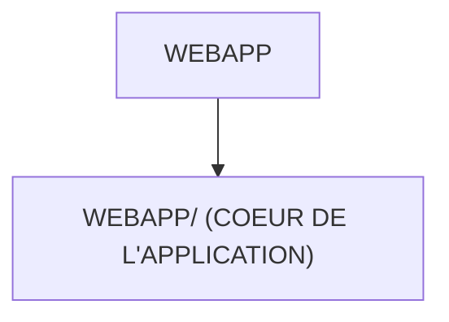

# 🌸 WEBAPP

## 🌺 OBJECTIFS

- [ ] Expliquer le rôle de **WEBAPP** dans le contexte présenté.
- [ ] Comprendre **webapp/ (coeur de l'application)**.
- [ ] Appliquer la notion dans un exemple simple.
- [ ] Reconnaître les erreurs fréquentes et les limites de l’approche.
## 🌺 VUE D'ENSEMBLE




## 🌺 WEBAPP/ (COEUR DE L'APPLICATION)

```
fgifirstappmodulename/
└── webapp/ # <- Contenu principal de l'application Fiori
```

> [!IMPORTANT]
> - 🎯 Objectif
>   Contenir tout ce qui est exécuté dans le navigateur.
> - 🔨 Utilité : UI5 charge exclusivement ce dossier pour afficher l’application.
> - ⌚ Quand utilisé ? À chaque fois que l’app démarre.

📌 Exemple :

     Les vues XML, les controllers JS et le manifest sont tous ici.

## 🌺 RÉSUMÉ

> - **Webapp/ (coeur de l'application) :** Les vues XML, les controllers JS et le manifest sont tous ici.

<details>
<summary>🍧 Afficher l’auto-évaluation</summary>

- [ ] Je peux définir **WEBAPP** avec mes propres mots.
- [ ] Je peux expliquer **webapp/ (coeur de l'application)** sans relire le chapitre.
- [ ] Je peux appliquer ou illustrer **un exemple concret** dans un exemple simple.
- [ ] Je peux identifier au moins une erreur fréquente ou une limite liée à cette notion.

</details>
