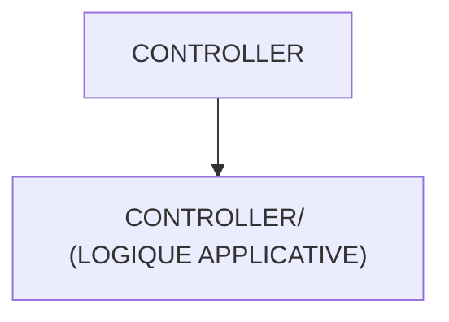

# 🌸 CONTROLLER

## 🌺 OBJECTIFS

- [ ] Expliquer le rôle de **CONTROLLER** dans le contexte présenté.
- [ ] Comprendre **controller/ (logique applicative)**.
- [ ] Appliquer la notion dans un exemple simple.
- [ ] Reconnaître les erreurs fréquentes et les limites de l’approche.

## 🌺 VUE D'ENSEMBLE



## 🌺 CONTROLLER/ (LOGIQUE APPLICATIVE)

```
fgifirstappmodulename/
├── webapp/
│   ├── (annotations/)
│   │
│   ├── controller/ # <- Dossier contenant les Contrôleurs JavaScript
│   │
│   ├── css/
│   ├── i18n/
│   ├── libs/
│   ├── localService/
│   ├── model/
│   ├── view/
│   ├── Component.js
│   ├── index.html
│   └── manifest.json
│
├── .gitignore
├── (mta.yaml)
├── package-lock.json
├── package.json
├── README.md
├── ui5-local.yaml
├── ui5-mock.yaml
└── ui5.yaml
```

> [!IMPORTANT]
>
> - 🎯 Objectif : contenir les contrôleurs associés aux vues.
> - 🔨 Utilité : gérer le cycle de vie de la vue, les événements UI et la coordination avec les modèles et services.
> - ⌚ Utilisation : lorsqu'une vue référence un contrôleur avec `controllerName` ou qu'un handler d'événement est déclaré.

### 🍧 RESPONSABILITÉS

Un contrôleur peut :

- initialiser l'état propre à la vue dans `onInit` ;
- réagir à un événement déclaré dans la vue ;
- lire ou mettre à jour un modèle par son nom ;
- demander une navigation au routeur ;
- déléguer les accès métier ou OData à un service dédié.

Il ne doit pas contenir de texte traduisible en dur, de manipulation directe du DOM évitable ni une copie de logique métier déjà disponible dans un service.

```javascript
sap.ui.define([
  "sap/ui/core/mvc/Controller"
], function (Controller) {
  "use strict";

  return Controller.extend("formation.controller.Home", {
    onInit: function () {
      // Initialisation limitée à la vue Home
    },

    onRefresh: function () {
      this.getView().getModel().refresh();
    }
  });
});
```

Le namespace de `Controller.extend` doit correspondre au namespace de l'application et au chemin du fichier.

## 🌺 RÉSUMÉ

> - Le contrôleur relie la vue aux modèles, aux événements et à la navigation sans absorber toute la logique applicative.

<details>
<summary>🍧 Afficher l’auto-évaluation</summary>

- [ ] Je peux définir **CONTROLLER** avec mes propres mots.
- [ ] Je peux expliquer **controller/ (logique applicative)** sans relire le chapitre.
- [ ] Je peux appliquer ou illustrer **un exemple concret** dans un exemple simple.
- [ ] Je peux identifier au moins une erreur fréquente ou une limite liée à cette notion.

</details>
