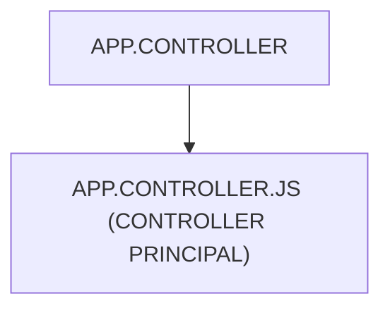

# 🌸 APP.CONTROLLER

## 🌺 OBJECTIFS

- [ ] Expliquer le rôle de **APP.CONTROLLER** dans le contexte présenté.
- [ ] Comprendre **app.controller.js (controller principal)**.
- [ ] Appliquer la notion dans un exemple simple.
- [ ] Reconnaître les erreurs fréquentes et les limites de l’approche.
## 🌺 VUE D'ENSEMBLE




## 🌺 APP.CONTROLLER.JS (CONTROLLER PRINCIPAL)

```
fgifirstappmodulename/
├── webapp/
│   ├── (annotations/)
│   │   └── (annotation.xml)
│   │
│   ├── controller/
│   │   ├── App.controller.js # <- Contrôleur principal
│   │   ├── BaseController.js
│   │   ├── Home.controller.js
│   │   ├── Detail.controller.js
│   │   └── <view_n>.controller.js
│   │
│   ├── css/
│   ├── i18n/
│   ├── libs/
│   ├── localService/
│   ├── model/
│   ├── view/
│   ├── Component.js
│   ├── index.html
│   └── manifest.json
│
├── .gitignore
├── (mta.yaml)
├── package-lock.json
├── package.json
├── README.md
├── ui5-local.yaml
├── ui5-mock.yaml
└── ui5.yaml
```

> [!IMPORTANT]
> - 🎯 Objectif
>   Gérer le cycle de vie global de l’application.
> - 🔨 Utilité : Initialiser l’application et gérer les événements globaux.
> - ⌚ Quand utilisé ? Au démarrage de l’application ou pour des comportements transverses.
>   📌 Exemple :

```js
/**
 * sap.ui.define
 * ---------------------------------------------------------------------------
 * Déclaration d’un module SAPUI5.
 *
 * Ici : création d’un contrôleur App.
 * SAPUI5 charge les dépendances puis les injecte dans la fonction callback.
 */
sap.ui.define(
  [
    /**********************************************************************
     * sap/ui/core/mvc/Controller
     * --------------------------------------------------------------------
     * Classe de base des contrôleurs SAPUI5.
     *
     * Elle fournit :
     * - cycle de vie (onInit, onExit)
     * - gestion des événements
     * - accès à la vue et aux modèles
     **********************************************************************/
    "sap/ui/core/mvc/Controller",
  ],

  /**
   * Callback exécuté après chargement des dépendances.
   *
   * BaseController correspond ici à sap.ui.core.mvc.Controller.
   */
  (BaseController) => {
    "use strict";

    /**********************************************************************
     * "use strict"
     * --------------------------------------------------------------------
     * Active le mode strict JavaScript.
     *
     * Sécurise l’exécution :
     * - interdit variables globales implicites
     * - rend certaines erreurs explicites
     **********************************************************************/

    /**********************************************************************
     * Définition du contrôleur App
     * --------------------------------------------------------------------
     * Controller.extend(...)
     * crée une sous-classe de Controller.
     *
     * Nom fully-qualified obligatoire :
     * fr.stms.fgifirstappmodulename.controller.App
     **********************************************************************/
    return BaseController.extend(
      "fr.stms.fgifirstappmodulename.controller.App",
      {
        /******************************************************************
         * onInit
         * ----------------------------------------------------------------
         * Hook du cycle de vie SAPUI5.
         *
         * Appelé automatiquement lors de l’instanciation du contrôleur.
         *
         * Utilisation typique :
         * - initialisation de modèles
         * - configuration de la vue
         * - chargement de données initiales
         ******************************************************************/
        onInit: function () {},
      },
    );
  },
);
```

## 🌺 RÉSUMÉ

> - Savoir utiliser **app.controller.js (controller principal)** dans le contexte présenté.

<details>
<summary>🍧 Afficher l’auto-évaluation</summary>

- [ ] Je peux définir **APP.CONTROLLER** avec mes propres mots.
- [ ] Je peux expliquer **app.controller.js (controller principal)** sans relire le chapitre.
- [ ] Je peux appliquer ou illustrer **un exemple concret** dans un exemple simple.
- [ ] Je peux identifier au moins une erreur fréquente ou une limite liée à cette notion.

</details>
