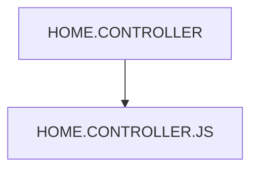

# 🌸 HOME.CONTROLLER

## 🌺 OBJECTIFS

- [ ] Expliquer le rôle de **HOME.CONTROLLER** dans le contexte présenté.
- [ ] Comprendre **home.controller.js**.
- [ ] Appliquer la notion dans un exemple simple.
- [ ] Reconnaître les erreurs fréquentes et les limites de l’approche.
## 🌺 VUE D'ENSEMBLE




## 🌺 HOME.CONTROLLER.JS

```
fgifirstappmodulename/
├── webapp/
│   ├── (annotations/)
│   │   └── (annotation.xml)
│   │
│   ├── controller/
│   │   ├── App.controller.js
│   │   ├── BaseController.js
│   │   ├── Home.controller.js # <- Contrôleur de la vue Home
│   │   ├── Detail.controller.js
│   │   └── <view_n>.controller.js
│   │
│   ├── css/
│   ├── i18n/
│   ├── libs/
│   ├── localService/
│   ├── model/
│   ├── view/
│   ├── Component.js
│   ├── index.html
│   └── manifest.json
│
├── .gitignore
├── (mta.yaml)
├── package-lock.json
├── package.json
├── README.md
├── ui5-local.yaml
├── ui5-mock.yaml
└── ui5.yaml
```

> [!IMPORTANT]
> - 🎯 Objectif
>   Gérer la logique métier de la vue Home.
> - 🔨 Utilité : Réagir aux actions utilisateur sur l’écran principal/la vue principale (sélection, navigation, chargement initial).
> - ⌚ Quand utilisé ? Lors de l’affichage ou de l’interaction avec la vue Home.

📌 Exemple de base :

```js
/**
 * sap.ui.define
 * ---------------------------------------------------------------------------
 * Déclaration d’un module SAPUI5.
 *
 * Ici : contrôleur Home de l’application.
 * SAPUI5 charge les dépendances puis les injecte dans la fonction callback.
 */
sap.ui.define(
  [
    /**********************************************************************
     * Controller SAPUI5
     * --------------------------------------------------------------------
     * Classe de base des contrôleurs SAPUI5.
     *
     * Fournit :
     * - cycle de vie (onInit, onBeforeRendering, onAfterRendering)
     * - accès à la View
     * - gestion des événements UI
     **********************************************************************/
    "sap/ui/core/mvc/Controller",
  ],

  /**
   * Callback exécuté après chargement des dépendances.
   *
   * Controller correspond à sap.ui.core.mvc.Controller.
   */
  (Controller) => {
    "use strict";

    /**********************************************************************
     * "use strict"
     * --------------------------------------------------------------------
     * Mode strict JavaScript.
     *
     * Rend le code plus sûr :
     * - erreurs visibles
     * - interdiction des variables globales implicites
     **********************************************************************/

    /**********************************************************************
     * Contrôleur Home
     * --------------------------------------------------------------------
     * Controller.extend(...)
     * crée une classe contrôleur spécifique à la vue Home.
     *
     * Nom fully-qualified :
     * fr.stms.fgifirstappmodulename.controller.Home
     **********************************************************************/
    return Controller.extend("fr.stms.fgifirstappmodulename.controller.Home", {
      /******************************************************************
       * onInit
       * ----------------------------------------------------------------
       * Hook du cycle de vie SAPUI5.
       *
       * Appelé automatiquement lors de l’instanciation du contrôleur.
       *
       * Utilisé pour :
       * - initialisation de la vue
       * - appels de données
       * - configuration de l’état initial
       ******************************************************************/
      onInit() {},
    });
  },
);
```

📌 Exemple avec héritage du BaseController :

```js
/**
 * sap.ui.define
 * ---------------------------------------------------------------------------
 * Déclaration d’un module SAPUI5.
 *
 * Ici : contrôleur Home qui hérite d’un BaseController personnalisé.
 */
sap.ui.define(
  [
    /**********************************************************************
     * BaseController
     * --------------------------------------------------------------------
     * Contrôleur personnalisé de l’application.
     *
     * Contient des méthodes utilitaires réutilisables :
     * - getModel()
     * - setModel()
     * - getRouter()
     **********************************************************************/
    "fr/stms/fgifirstappmodulename/controller/BaseController",
  ],

  /**
   * Callback exécuté après chargement des dépendances.
   *
   * BaseController est injecté ici comme classe parente.
   */
  (BaseController) => {
    "use strict";

    /**********************************************************************
     * BaseController.extend(...)
     * --------------------------------------------------------------------
     * Création du contrôleur Home en héritant du BaseController.
     *
     * Héritage :
     * HomeController -> BaseController -> sap.ui.core.mvc.Controller
     **********************************************************************/
    return BaseController.extend(
      "fr.stms.fgifirstappmodulename.controller.Home",
      {
        /******************************************************************
         * onInit
         * ----------------------------------------------------------------
         * Hook du cycle de vie SAPUI5.
         *
         * Appelé automatiquement à l’instanciation du contrôleur.
         *
         * Utilisation :
         * - initialisation de données
         * - appels services
         * - configuration UI initiale
         ******************************************************************/
        onInit: function () {},
      },
    );
  },
);
```

## 🌺 RÉSUMÉ

> - **Home.controller.js :** 📌 Exemple avec héritage du BaseController :

<details>
<summary>🍧 Afficher l’auto-évaluation</summary>

- [ ] Je peux définir **HOME.CONTROLLER** avec mes propres mots.
- [ ] Je peux expliquer **home.controller.js** sans relire le chapitre.
- [ ] Je peux appliquer ou illustrer **un exemple concret** dans un exemple simple.
- [ ] Je peux identifier au moins une erreur fréquente ou une limite liée à cette notion.

</details>
