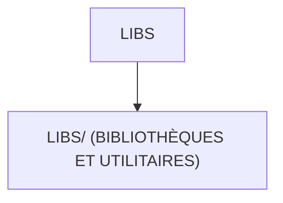

# 🌸 LIBS

## 🌺 OBJECTIFS

- [ ] Expliquer le rôle de **LIBS** dans le contexte présenté.
- [ ] Comprendre **libs/ (bibliothèques et utilitaires)**.
- [ ] Appliquer la notion dans un exemple simple.
- [ ] Reconnaître les erreurs fréquentes et les limites de l’approche.

## 🌺 VUE D'ENSEMBLE



## 🌺 LIBS/ (BIBLIOTHÈQUES ET UTILITAIRES)

```
fgifirstappmodulename/
├── webapp/
│   ├── (annotations/)
│   ├── controller/
│   ├── css/
│   ├── i18n/
│   │
│   ├── libs/ # <- Fonctions et utilitaires
│   │
│   ├── localService/
│   ├── model/
│   ├── view/
│   ├── Component.js
│   ├── index.html
│   └── manifest.json
│
├── .gitignore
├── (mta.yaml)
├── package-lock.json
├── package.json
├── README.md
├── ui5-local.yaml
├── ui5-mock.yaml
└── ui5.yaml
```

> [!IMPORTANT]
>
> - 🎯 Objectif
>   Regrouper les fonctions utilitaires réutilisables de l’application.
> - 🔨 Utilité : Centraliser la logique transverse (formatage, appels de services, helpers).
> - ⌚ Quand utilisé ? Lorsqu’une fonction est utilisée dans plusieurs contrôleurs ou vues.

📌 Exemple :

     Créer des fonctions génériques appelées depuis les contrôleurs.

## 🌺 RÉSUMÉ

> - **Libs/ (bibliothèques et utilitaires) :** Créer des fonctions génériques appelées depuis les contrôleurs.

<details>
<summary>🍧 Afficher l’auto-évaluation</summary>

- [ ] Je peux définir **LIBS** avec mes propres mots.
- [ ] Je peux expliquer **libs/ (bibliothèques et utilitaires)** sans relire le chapitre.
- [ ] Je peux appliquer ou illustrer **un exemple concret** dans un exemple simple.
- [ ] Je peux identifier au moins une erreur fréquente ou une limite liée à cette notion.

</details>
