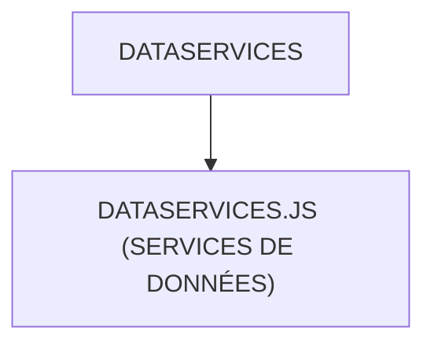

# 🌸 DATASERVICES

## 🌺 OBJECTIFS

- [ ] Expliquer le rôle de **DATASERVICES** dans le contexte présenté.
- [ ] Comprendre **dataservices.js (services de données)**.
- [ ] Appliquer la notion dans un exemple simple.
- [ ] Reconnaître les erreurs fréquentes et les limites de l’approche.

## 🌺 VUE D'ENSEMBLE



## 🌺 DATASERVICES.JS (SERVICES DE DONNÉES)

```
fgifirstappmodulename/
├── webapp/
│   ├── (annotations/)
│   ├── controller/
│   ├── css/
│   ├── i18n/
│   │
│   ├── libs/
│   │   ├── DataServices.js # <- Services de données génériques
│   │   └── Formatter.js
│   │
│   ├── localService/
│   ├── model/
│   ├── view/
│   ├── Component.js
│   ├── index.html
│   └── manifest.json
│
├── .gitignore
├── (mta.yaml)
├── package-lock.json
├── package.json
├── README.md
├── ui5-local.yaml
├── ui5-mock.yaml
└── ui5.yaml
```

> [!IMPORTANT]
>
> - 🎯 Objectif
>   Centraliser les appels aux services backend.
> - 🔨 Utilité : Encapsuler la logique d’accès aux données (OData, REST, gestion des erreurs).
> - ⌚ Quand utilisé ? Lorsqu’un contrôleur doit lire ou écrire des données sans gérer directement la complexité technique.

📌 Exemple :

```js
/**
 * sap.ui.define
 * ---------------------------------------------------------------------------
 * Déclaration d’un module SAPUI5.
 *
 * Ici : création d’un service métier DataService.
 * Objectif : centraliser la logique de données (API, OData, JSON, etc.).
 */
sap.ui.define(
  [
    /**********************************************************************
     * EventProvider
     * --------------------------------------------------------------------
     * Classe SAPUI5 permettant la gestion d’événements personnalisés.
     *
     * Permet :
     * - fireEvent(...)
     * - attachEvent(...)
     * - detachEvent(...)
     *
     * Utilité :
     * communication entre composants sans couplage direct.
     **********************************************************************/
    "sap/ui/base/EventProvider",

    /**********************************************************************
     * JSONModel
     * --------------------------------------------------------------------
     * Modèle SAPUI5 basé sur un objet JSON JavaScript.
     *
     * Permet :
     * - stockage de données locales
     * - binding vers les vues XML
     * - manipulation simple côté frontend
     **********************************************************************/
    "sap/ui/model/json/JSONModel",
  ],

  /**
   * Callback exécuté après chargement des dépendances.
   */
  function (EventProvider, JSONModel) {
    "use strict";

    /**********************************************************************
     * DataService
     * --------------------------------------------------------------------
     * Classe métier personnalisée.
     *
     * Hérite de EventProvider :
     * => peut émettre et écouter des événements
     *
     * Rôle typique :
     * - appels backend (OData / REST)
     * - transformation des données
     * - stockage temporaire (JSONModel)
     * - centralisation de la logique applicative
     **********************************************************************/
    return EventProvider.extend(
      "fr.stms.fgifirstappmodulename.libs.DataService",
      {
        /******************************************************************
         * Zone métier du service
         * ----------------------------------------------------------------
         * Ici seront implémentées :
         * - méthodes d’appel API
         * - gestion éventuelles des données
         * - événements personnalisés
         ******************************************************************/
        /* Code ici */
      },
    );
  },
);
```

## 🌺 RÉSUMÉ

> - Savoir utiliser **dataservices.js (services de données)** dans le contexte présenté.

<details>
<summary>🍧 Afficher l’auto-évaluation</summary>

- [ ] Je peux définir **DATASERVICES** avec mes propres mots.
- [ ] Je peux expliquer **dataservices.js (services de données)** sans relire le chapitre.
- [ ] Je peux appliquer ou illustrer **un exemple concret** dans un exemple simple.
- [ ] Je peux identifier au moins une erreur fréquente ou une limite liée à cette notion.

</details>
