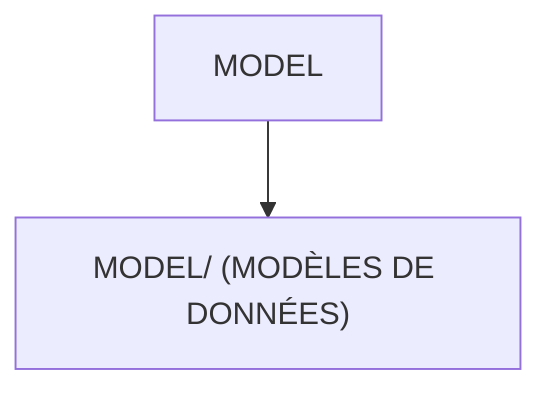

# 🌸 MODEL

## 🌺 OBJECTIFS

- [ ] Expliquer le rôle de **MODEL** dans le contexte présenté.
- [ ] Comprendre **model/ (modèles de données)**.
- [ ] Appliquer la notion dans un exemple simple.
- [ ] Reconnaître les erreurs fréquentes et les limites de l’approche.
## 🌺 VUE D'ENSEMBLE




## 🌺 MODEL/ (MODÈLES DE DONNÉES)

```
fgifirstappmodulename/
├── webapp/
│   ├── (annotations/)
│   ├── controller/
│   ├── css/
│   ├── i18n/
│   ├── libs/
│   ├── localService/
│   │
│   ├── model/ # <- Modèles de données côté client
│   │
│   ├── view/
│   ├── Component.js
│   ├── index.html
│   └── manifest.json
│
├── .gitignore
├── (mta.yaml)
├── package-lock.json
├── package.json
├── README.md
├── ui5-local.yaml
├── ui5-mock.yaml
└── ui5.yaml
```

> [!IMPORTANT]
> - 🎯 Objectif
>   Centraliser la gestion des modèles de données côté client.
> - 🔨 Utilité : Définir et exposer les modèles utilisés par l’application (OData, JSON, Resource).
> - ⌚ Quand utilisé ? Dès que l’application manipule des données (backend, données locales, paramètres).
> - 📌 Exemple :
>   Utiliser un modèle JSON pour stocker des données temporaires.

### 🍧 MODELS.JS (DÉFINITION DES MODÈLES)

```
fgifirstappmodulename/
├── webapp/
│   ├── (annotations/)
│   ├── controller/
│   ├── css/
│   ├── i18n/
│   ├── libs/
│   ├── localService/
│   │
│   ├── model/
│   │   └── models.js # <- Définition des modèles
│   │
│   ├── view/
│   ├── Component.js
│   ├── index.html
│   └── manifest.json
│
├── .gitignore
├── (mta.yaml)
├── package-lock.json
├── package.json
├── README.md
├── ui5-local.yaml
├── ui5-mock.yaml
└── ui5.yaml
```

> [!IMPORTANT]
> - 🎯 Objectif
>   Initialiser et configurer les modèles de l’application.
> - 🔨 Utilité : Créer les modèles (OData, JSON, i18n)
>   et les rendre accessibles aux vues et contrôleurs.
> - ⌚ Quand utilisé ? Au démarrage de l’application
>   (chargé depuis Component.js).

📌 Exemple :

```js
sap.ui.define(
  ["sap/ui/model/json/JSONModel", "sap/ui/Device"],
  function (JSONModel, Device) {
    "use strict";

    return {
      /**
       * Provides runtime information for the device the UI5 app is running on as a JSONModel.
       * @returns {sap.ui.model.json.JSONModel} The device model.
       */
      createDeviceModel: function () {
        var oModel = new JSONModel(Device);
        oModel.setDefaultBindingMode("OneWay");
        return oModel;
      },
    };
  },
);
```

## 🌺 RÉSUMÉ

> - Savoir utiliser **model/ (modèles de données)** dans le contexte présenté.

<details>
<summary>🍧 Afficher l’auto-évaluation</summary>

- [ ] Je peux définir **MODEL** avec mes propres mots.
- [ ] Je peux expliquer **model/ (modèles de données)** sans relire le chapitre.
- [ ] Je peux appliquer ou illustrer **un exemple concret** dans un exemple simple.
- [ ] Je peux identifier au moins une erreur fréquente ou une limite liée à cette notion.

</details>
