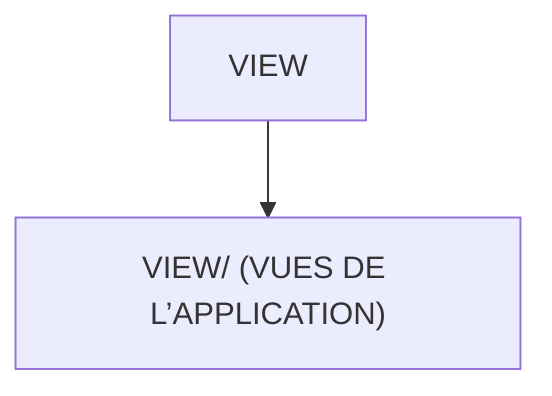

# 🌸 VIEW

## 🌺 OBJECTIFS

- [ ] Expliquer le rôle de **VIEW** dans le contexte présenté.
- [ ] Comprendre **view/ (vues de l’application)**.
- [ ] Appliquer la notion dans un exemple simple.
- [ ] Reconnaître les erreurs fréquentes et les limites de l’approche.

## 🌺 VUE D'ENSEMBLE



## 🌺 VIEW/ (VUES DE L’APPLICATION)

```
fgifirstappmodulename/
├── webapp/
│   ├── (annotations/)
│   ├── controller/
│   ├── css/
│   ├── i18n/
│   ├── libs/
│   ├── localService/
│   ├── model/
│   │
│   ├── view/ # <- Vues de l'application
│   │
│   ├── Component.js
│   ├── index.html
│   └── manifest.json
│
├── .gitignore
├── (mta.yaml)
├── package-lock.json
├── package.json
├── README.md
├── ui5-local.yaml
├── ui5-mock.yaml
└── ui5.yaml
```

> [!IMPORTANT]
>
> - 🎯 Objectif
>   Définir l’interface utilisateur de l’application.
> - 🔨 Utilité : Décrire la structure visuelle des écrans (boutons, champs, tableaux, layouts).
> - ⌚ Quand utilisé ? À chaque affichage d’un écran de l’application (Home, Detail, etc.).
> - 📌 Exemple :
>   Une vue XML décrivant un écran avec un titre et une liste.

## 🌺 RÉSUMÉ

> - Savoir utiliser **view/ (vues de l’application)** dans le contexte présenté.

<details>
<summary>🍧 Afficher l’auto-évaluation</summary>

- [ ] Je peux définir **VIEW** avec mes propres mots.
- [ ] Je peux expliquer **view/ (vues de l’application)** sans relire le chapitre.
- [ ] Je peux appliquer ou illustrer **un exemple concret** dans un exemple simple.
- [ ] Je peux identifier au moins une erreur fréquente ou une limite liée à cette notion.

</details>
