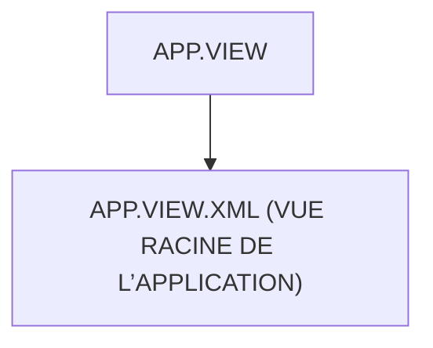

# 🌸 APP.VIEW

## 🌺 OBJECTIFS

- [ ] Expliquer le rôle de **APP.VIEW** dans le contexte présenté.
- [ ] Comprendre **app.view.xml (vue racine de l’application)**.
- [ ] Appliquer la notion dans un exemple simple.
- [ ] Reconnaître les erreurs fréquentes et les limites de l’approche.

## 🌺 VUE D'ENSEMBLE



## 🌺 APP.VIEW.XML (VUE RACINE DE L’APPLICATION)

```
fgifirstappmodulename/
├── webapp/
│   ├── (annotations/)
│   ├── controller/
│   ├── css/
│   ├── i18n/
│   ├── libs/
│   ├── localService/
│   ├── model/
│   │
│   ├── view/
│   │   ├── fragments/
│   │   │   └── <fragment_n>.fragment.xml
│   │   │
│   │   ├── App.view.xml # <- Vue App
│   │   ├── Home.view.xml
│   │   ├── Detail.view.xml
│   │   └── <view_n>.view.xml
│   │
│   ├── Component.js
│   ├── index.html
│   └── manifest.json
│
├── .gitignore
├── (mta.yaml)
├── package-lock.json
├── package.json
├── README.md
├── ui5-local.yaml
├── ui5-mock.yaml
└── ui5.yaml
```

> [!IMPORTANT]
>
> - 🎯 Objectif
>   Définir le conteneur principal de l’application.
> - 🔨 Utilité : Héberger le NavContainer ou Router qui gère la navigation entre les vues.
> - ⌚ Quand utilisé ? Chargée une seule fois au démarrage de l’application.

📌 Exemple :

```xml
<!--
=====================================================================
SAPUI5 XML VIEW
=====================================================================

OBJECTIF GLOBAL :
- Définir l’interface utilisateur de l’application Fiori
- Être liée à un controller JavaScript
- Servir de base au routing SAPUI5
- Construire l’écran sans logique métier (uniquement UI)
-->

<mvc:View
    controllerName="fr.stms.fgifirstappmodulename.controller.App"
    displayBlock="true"
    xmlns:mvc="sap.ui.core.mvc"
    xmlns="sap.m">

    <!--
    =================================================================
    CONTENEUR PRINCIPAL DE L’APPLICATION
    =================================================================

    COMPOSANT : sap.m.App

    RÔLE :
    - conteneur racine de navigation SAPUI5
    - affiche les différentes pages de l’application
    - gère la navigation forward / back
    - point d’entrée du routing Fiori

    FONCTIONNEMENT :
    - le router injecte les views ici
    - chaque route correspond à une page affichée

    IMPORTANT :
    - id="app" est utilisé dans manifest.json (routing config)
    - c’est le point d’ancrage de toutes les vues
    -->

    <App id="app">

        <!--
        ZONE D’AFFICHAGE DYNAMIQUE

        Ici SAPUI5 va injecter automatiquement les vues :
        - Home.view.xml
        - Detail.view.xml
        - etc.

        Injection réalisée par le Router (manifest.json)
        -->

    </App>

</mvc:View>
```

## 🌺 RÉSUMÉ

> - Savoir utiliser **app.view.xml (vue racine de l’application)** dans le contexte présenté.

<details>
<summary>🍧 Afficher l’auto-évaluation</summary>

- [ ] Je peux définir **APP.VIEW** avec mes propres mots.
- [ ] Je peux expliquer **app.view.xml (vue racine de l’application)** sans relire le chapitre.
- [ ] Je peux appliquer ou illustrer **un exemple concret** dans un exemple simple.
- [ ] Je peux identifier au moins une erreur fréquente ou une limite liée à cette notion.

</details>
