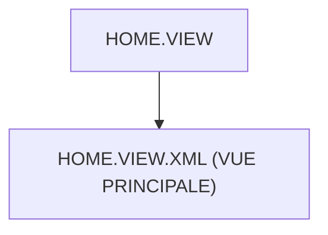

# 🌸 HOME.VIEW

## 🌺 OBJECTIFS

- [ ] Expliquer le rôle de **HOME.VIEW** dans le contexte présenté.
- [ ] Comprendre **home.view.xml (vue principale)**.
- [ ] Appliquer la notion dans un exemple simple.
- [ ] Reconnaître les erreurs fréquentes et les limites de l’approche.

## 🌺 VUE D'ENSEMBLE



## 🌺 HOME.VIEW.XML (VUE PRINCIPALE)

```
fgifirstappmodulename/
├── webapp/
│   ├── (annotations/)
│   ├── controller/
│   ├── css/
│   ├── i18n/
│   ├── libs/
│   ├── localService/
│   ├── model/
│   │
│   ├── view/
│   │   ├── fragments/
│   │   │   └── <fragment_n>.fragment.xml
│   │   │
│   │   ├── App.view.xml
│   │   ├── Home.view.xml # <- Vue Home
│   │   ├── Detail.view.xml
│   │   └── <view_n>.view.xml
│   │
│   ├── Component.js
│   ├── index.html
│   └── manifest.json
│
├── .gitignore
├── (mta.yaml)
├── package-lock.json
├── package.json
├── README.md
├── ui5-local.yaml
├── ui5-mock.yaml
└── ui5.yaml
```

> [!IMPORTANT]
>
> - 🎯 Objectif
>   Afficher l’écran d’accueil de l’application.
> - 🔨 Utilité : Présenter une liste, un tableau ou un résumé des données principales.
> - ⌚ Quand utilisé ? Lorsqu’un utilisateur ouvre l’application.

📌 Exemple :

```xml
<?xml version="1.0" encoding="UTF-8"?>

<!--
==========================================================
SAPUI5 XML VIEW (Fiori)
==========================================================

Rôle de ce fichier :
- Décrire l’interface utilisateur (UI)
- Définir les composants visuels (Page, Button, Table…)
- Être lié à un controller JavaScript

Important :
- XML = structure UI
- Controller = logique métier (JavaScript)
-->

<mvc:View
    controllerName="fr.stms.fgifirstappmodulename.controller.Home"
    xmlns:mvc="sap.ui.core.mvc"
    xmlns="sap.m"
>

    <!--
    ==========================================================
    mvc:View
    ==========================================================

    controllerName :
    - lien entre la vue XML et le fichier JavaScript controller
    - ici : Home.controller.js

    Exemple :
    fr.stms.fgifirstappmodulename.controller.Home
    => classe JavaScript qui gère les événements (click, init, etc.)

    xmlns:mvc :
    - définit le namespace SAPUI5 MVC (Model View Controller)
    - nécessaire pour utiliser <mvc:View>

    xmlns="sap.m" :
    - bibliothèque UI5 utilisée
    - sap.m = contrôles mobiles (Page, Button, Input, Table…)
    -->

    <!--
    ==========================================================
    PAGE SAPUI5
    ==========================================================

    Page = conteneur principal d’écran Fiori

    Rôle :
    - structure une vue complète
    - contient header, content, footer
    -->

    <Page
        id="page"
        title="{i18n>title}"
    >

        <!--
        ==========================================================
        id="page"
        ==========================================================

        Identifiant unique de la vue dans le DOM UI5.
        Permet :
        - getView().byId("page")
        - manipulation en JavaScript

        ==========================================================
        title="{i18n>title}"
        ==========================================================

        Binding i18n (internationalisation)

        {i18n>title} signifie :
        - aller dans le modèle i18n
        - récupérer la clé "title"
        - afficher sa valeur traduite

        Exemple :
        i18n.properties :
            title=Gestion des sessions
        -->

    </Page>

</mvc:View>
```

## 🌺 RÉSUMÉ

> - Savoir utiliser **home.view.xml (vue principale)** dans le contexte présenté.

<details>
<summary>🍧 Afficher l’auto-évaluation</summary>

- [ ] Je peux définir **HOME.VIEW** avec mes propres mots.
- [ ] Je peux expliquer **home.view.xml (vue principale)** sans relire le chapitre.
- [ ] Je peux appliquer ou illustrer **un exemple concret** dans un exemple simple.
- [ ] Je peux identifier au moins une erreur fréquente ou une limite liée à cette notion.

</details>
