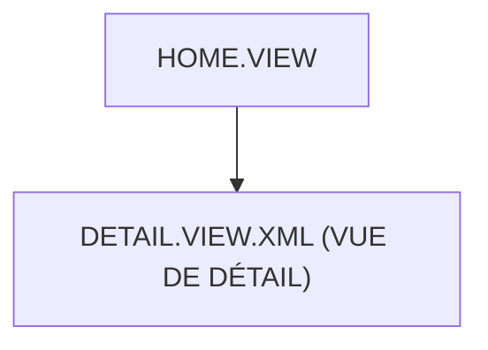

# 🌸 HOME.VIEW

## 🌺 OBJECTIFS

- [ ] Expliquer le rôle de **HOME.VIEW** dans le contexte présenté.
- [ ] Comprendre **detail.view.xml (vue de détail)**.
- [ ] Appliquer la notion dans un exemple simple.
- [ ] Reconnaître les erreurs fréquentes et les limites de l’approche.

## 🌺 VUE D'ENSEMBLE



## 🌺 DETAIL.VIEW.XML (VUE DE DÉTAIL)

```
fgifirstappmodulename/
├── webapp/
│   ├── (annotations/)
│   ├── controller/
│   ├── css/
│   ├── i18n/
│   ├── libs/
│   ├── localService/
│   ├── model/
│   │
│   ├── view/
│   │   ├── fragments/
│   │   │   └── <fragment_n>.fragment.xml
│   │   │
│   │   ├── App.view.xml
│   │   ├── Home.view.xml
│   │   ├── Detail.view.xml # <- Vue Detail
│   │   └── <view_n>.view.xml
│   │
│   ├── Component.js
│   ├── index.html
│   └── manifest.json
│
├── .gitignore
├── (mta.yaml)
├── package-lock.json
├── package.json
├── README.md
├── ui5-local.yaml
├── ui5-mock.yaml
└── ui5.yaml
```

> [!IMPORTANT]
>
> - 🎯 Objectif
>   Afficher les informations détaillées d’un élément sélectionné.
> - 🔨 Utilité : Montrer les données complètes liées à un objet métier.
> - ⌚ Quand utilisé ? Après une navigation depuis la vue Home
>   vers un élément précis.

📌 Exemple :

```xml
<?xml version="1.0" encoding="UTF-8"?>

<!--
==========================================================
SAPUI5 XML VIEW : DETAILS
==========================================================

OBJECTIF :
Cette vue représente l’écran de détail d’une entité (ex : Session).

Elle est affichée lorsque l’utilisateur clique sur un élément dans une liste.

Elle est pilotée par un controller JavaScript.
-->

<mvc:View
    controllerName="fr.stms.fgifirstappmodulename.controller.Details"
    xmlns:mvc="sap.ui.core.mvc"
    xmlns="sap.m"
>

    <!--
    ==========================================================
    MVC VIEW
    ==========================================================

    controllerName :
    - lien entre la vue XML et le controller JS
    - SAPUI5 instancie automatiquement ce controller

    Exemple :
    Details.controller.js

    Rôle du controller :
    - gérer la logique métier
    - récupérer les données
    - gérer les événements UI
    -->

    <!--
    xmlns:mvc :
    - active le framework MVC SAPUI5
    - permet d’utiliser <mvc:View>

    xmlns="sap.m" :
    - bibliothèque UI Fiori
    - contient Page, Button, Input, Table...
    -->

    <Page
        id="details"
    >

        <!--
        ==========================================================
        PAGE SAPUI5
        ==========================================================

        Une Page est un conteneur Fiori complet.

        Elle représente un écran avec :
        - zone header (titre)
        - zone content (contenu)
        - zone footer (actions)
        -->

        <!--
        id="details"

        Rôle :
        - identifiant unique de la page
        - permet de la récupérer dans le controller

        Exemple JS :
        this.byId("details")
        -->

        <!--
        ==========================================================
        CONTENU DE LA PAGE
        ==========================================================

        Actuellement vide.

        Dans une vraie application, on ajouterait :
        - ObjectHeader (résumé)
        - Input (édition)
        - Text (affichage)
        - Form (détail structuré)
        -->

    </Page>

</mvc:View>
```

## 🌺 RÉSUMÉ

> - Savoir utiliser **detail.view.xml (vue de détail)** dans le contexte présenté.

<details>
<summary>🍧 Afficher l’auto-évaluation</summary>

- [ ] Je peux définir **HOME.VIEW** avec mes propres mots.
- [ ] Je peux expliquer **detail.view.xml (vue de détail)** sans relire le chapitre.
- [ ] Je peux appliquer ou illustrer **un exemple concret** dans un exemple simple.
- [ ] Je peux identifier au moins une erreur fréquente ou une limite liée à cette notion.

</details>
