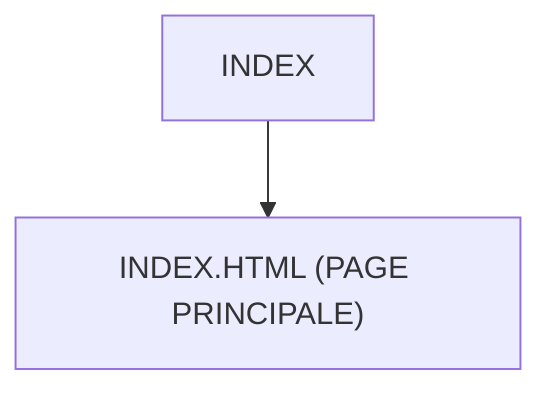

# 🌸 INDEX

## 🌺 OBJECTIFS

- [ ] Expliquer le rôle de **INDEX** dans le contexte présenté.
- [ ] Comprendre **index.html (page principale)**.
- [ ] Appliquer la notion dans un exemple simple.
- [ ] Reconnaître les erreurs fréquentes et les limites de l’approche.

## 🌺 VUE D'ENSEMBLE



## 🌺 INDEX.HTML (PAGE PRINCIPALE)

```
fgifirstappmodulename/
├── webapp/
│   ├── (annotations/)
│   ├── controller/
│   ├── css/
│   ├── i18n/
│   ├── libs/
│   ├── localService/
│   ├── model/
│   ├── view/
│   │
│   ├── Component.js
│   │
│   ├── index.html # <- Page HTML principale
│   │
│   └── manifest.json
│
├── .gitignore
├── (mta.yaml)
├── package-lock.json
├── package.json
├── README.md
├── ui5-local.yaml
├── ui5-mock.yaml
└── ui5.yaml
```

> [!IMPORTANT]
>
> - 🎯 Objectif
>   Charger l’application UI5 dans le navigateur.
> - 🔨 Utilité : Inclure les bibliothèques SAPUI5 et déclencher le bootstrap.
> - ⌚ Quand utilisé ? À l’ouverture de l’application dans le navigateur.

📌 Exemple :

```html
<!DOCTYPE html>
<html lang="en">
  <head>
    <meta charset="UTF-8" />
    <meta name="viewport" content="width=device-width, initial-scale=1.0" />
    <meta http-equiv="X-UA-Compatible" content="IE=edge" />
    <title>FGI First App Application Title</title>
    <style>
      html,
      body,
      body > div,
      #container,
      #container-uiarea {
        height: 100%;
      }
    </style>
    <script
      id="sap-ui-bootstrap"
      src="resources/sap-ui-core.js"
      data-sap-ui-theme="sap_horizon"
      data-sap-ui-resource-roots='{
            "fr.stms.fgifirstappmodulename": "./"
        }'
      data-sap-ui-on-init="module:sap/ui/core/ComponentSupport"
      data-sap-ui-compat-version="edge"
      data-sap-ui-async="true"
      data-sap-ui-frame-options="trusted"
    ></script>
  </head>
  <body class="sapUiBody sapUiSizeCompact" id="content">
    <div
      data-sap-ui-component
      data-name="fr.stms.fgifirstappmodulename"
      data-id="container"
      data-settings='{"id" : "fr.stms.fgifirstappmodulename"}'
      data-handle-validation="true"
    ></div>
  </body>
</html>
```

## 🌺 RÉSUMÉ

> - Savoir utiliser **index.html (page principale)** dans le contexte présenté.

<details>
<summary>🍧 Afficher l’auto-évaluation</summary>

- [ ] Je peux définir **INDEX** avec mes propres mots.
- [ ] Je peux expliquer **index.html (page principale)** sans relire le chapitre.
- [ ] Je peux appliquer ou illustrer **un exemple concret** dans un exemple simple.
- [ ] Je peux identifier au moins une erreur fréquente ou une limite liée à cette notion.

</details>
