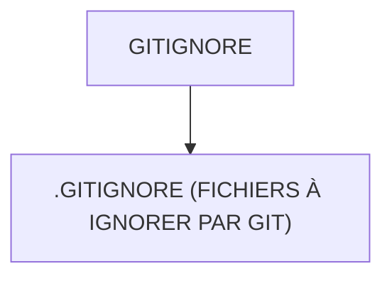

# 🌸 GITIGNORE

## 🌺 OBJECTIFS

- [ ] Expliquer le rôle de **GITIGNORE** dans le contexte présenté.
- [ ] Comprendre **.gitignore (fichiers à ignorer par git)**.
- [ ] Appliquer la notion dans un exemple simple.
- [ ] Reconnaître les erreurs fréquentes et les limites de l’approche.
## 🌺 VUE D'ENSEMBLE




## 🌺 .GITIGNORE (FICHIERS À IGNORER PAR GIT)

```
fgifirstappmodulename/
├── webapp/
│   ├── (annotations/)
│   ├── controller/
│   ├── css/
│   ├── i18n/
│   ├── libs/
│   ├── localService/
│   ├── model/
│   ├── view/
│   │
│   ├── Component.js
│   ├── index.html
│   └── manifest.json
│
├── .gitignore # <- Fichiers à ignorer par git
│
├── (mta.yaml)
├── package-lock.json
├── package.json
├── README.md
├── ui5-local.yaml
├── ui5-mock.yaml
└── ui5.yaml
```

> [!IMPORTANT]
> - 🎯 Objectif
>   Définir quels fichiers et dossiers ne doivent pas être suivis par Git.
> - 🔨 Utilité : Éviter de versionner des fichiers temporaires, logs, ou dépendances locales.
> - ⌚ Quand utilisé ? Lors des commits et push vers le dépôt.

📌 Exemple :

```
node_modules/
dist/
.scp/
.env
Makefile*.mta
mta_archives
mta-*
resources
archive.zip
.*_mta_build_tmp
```

## 🌺 RÉSUMÉ

> - Savoir utiliser **.gitignore (fichiers à ignorer par git)** dans le contexte présenté.

<details>
<summary>🍧 Afficher l’auto-évaluation</summary>

- [ ] Je peux définir **GITIGNORE** avec mes propres mots.
- [ ] Je peux expliquer **.gitignore (fichiers à ignorer par git)** sans relire le chapitre.
- [ ] Je peux appliquer ou illustrer **un exemple concret** dans un exemple simple.
- [ ] Je peux identifier au moins une erreur fréquente ou une limite liée à cette notion.

</details>
