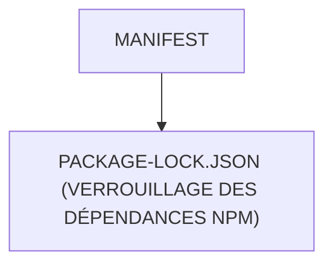

# 🌸 MANIFEST

## 🌺 OBJECTIFS

- [ ] Expliquer le rôle de **MANIFEST** dans le contexte présenté.
- [ ] Comprendre **package-lock.json (verrouillage des dépendances npm)**.
- [ ] Appliquer la notion dans un exemple simple.
- [ ] Reconnaître les erreurs fréquentes et les limites de l’approche.

## 🌺 VUE D'ENSEMBLE



## 🌺 PACKAGE-LOCK.JSON (VERROUILLAGE DES DÉPENDANCES NPM)

```
fgifirstappmodulename/
├── webapp/
│   ├── (annotations/)
│   ├── controller/
│   ├── css/
│   ├── i18n/
│   ├── libs/
│   ├── localService/
│   ├── model/
│   ├── view/
│   │
│   ├── Component.js
│   ├── index.html
│   └── manifest.json
│
├── .gitignore
├── (mta.yaml)
│
├── package-lock.json # <- Gestionnaire de versions npm
│
├── package.json
├── README.md
├── ui5-local.yaml
├── ui5-mock.yaml
└── ui5.yaml
```

> [!IMPORTANT]
>
> - 🎯 Objectif
>   Verrouiller les versions exactes des dépendances installées.
> - 🔨 Utilité : Garantir que tous les développeurs utilisent les mêmes versions.
> - ⌚ Quand utilisé ? Après un `npm install` pour sauvegarder l’arborescence exacte.
> - 📌 Exemple :
>   Contient les versions exactes de `@ui5/cli`, `@sap/ux-ui5-tooling`, etc.

## 🌺 RÉSUMÉ

> - Savoir utiliser **package-lock.json (verrouillage des dépendances npm)** dans le contexte présenté.

<details>
<summary>🍧 Afficher l’auto-évaluation</summary>

- [ ] Je peux définir **MANIFEST** avec mes propres mots.
- [ ] Je peux expliquer **package-lock.json (verrouillage des dépendances npm)** sans relire le chapitre.
- [ ] Je peux appliquer ou illustrer **un exemple concret** dans un exemple simple.
- [ ] Je peux identifier au moins une erreur fréquente ou une limite liée à cette notion.

</details>
