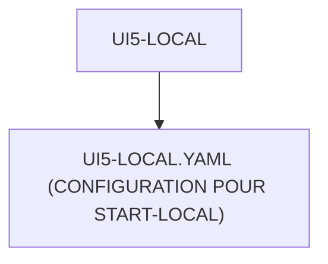

# 🌸 UI5-LOCAL

## 🌺 OBJECTIFS

- [ ] Expliquer le rôle de **UI5-LOCAL** dans le contexte présenté.
- [ ] Comprendre **ui5-local.yaml (configuration pour start-local)**.
- [ ] Appliquer la notion dans un exemple simple.
- [ ] Reconnaître les erreurs fréquentes et les limites de l’approche.

## 🌺 VUE D'ENSEMBLE



## 🌺 UI5-LOCAL.YAML (CONFIGURATION POUR START-LOCAL)

```
fgifirstappmodulename/
├── webapp/
│   ├── (annotations/)
│   ├── controller/
│   ├── css/
│   ├── i18n/
│   ├── libs/
│   ├── localService/
│   ├── model/
│   ├── view/
│   │
│   ├── Component.js
│   ├── index.html
│   └── manifest.json
│
├── .gitignore
├── (mta.yaml)
├── package-lock.json
├── package.json
├── README.md
│
├── ui5-local.yaml # <- Config UI5 pour start-local
│
├── ui5-mock.yaml
└── ui5.yaml
```

> [!IMPORTANT]
>
> - 🎯 Objectif
>   Configurer l’environnement pour se connecter à un backend réel.
> - 🔨 Utilité : Permettre à l’application de récupérer des données depuis un système SAP local ou distant.
> - ⌚ Quand utilisé ? Avec la commande `npm run start-local` ou `fiori run --config ui5-local.yaml`.

📌 Exemple :

```yaml
# yaml-language-server: $schema=https://sap.github.io/ui5-tooling/schema/ui5.yaml.json

##############################################################################
# UI5 TOOLING CONFIGURATION
# ---------------------------------------------------------------------------
# Fichier de configuration du projet UI5 Tooling (ui5 serve / ui5 build)
#
# Rôle :
# - définit le framework UI5 utilisé
# - configure les bibliothèques SAPUI5
# - configure les middlewares de développement
# - configure les proxys backend
# - configure le mock server
##############################################################################

specVersion: "4.0"

metadata:
  #**************************************************************************
  # IDENTIFICATION APPLICATION
  # ------------------------------------------------------------------------
  # Nom technique du module UI5
  #*************************************************************************/
  name: fr.stms.fgifirstappmodulename

type: application

framework:
  #**************************************************************************
  # FRAMEWORK SAPUI5
  # ------------------------------------------------------------------------
  # Version du runtime UI5 utilisé pour :
  # - build
  # - serve
  # - compatibilité runtime
  #*************************************************************************/
  name: SAPUI5
  version: 1.120.14

  #**************************************************************************
  # LIBRAIRIES SAPUI5 INCLUSES
  # ------------------------------------------------------------------------
  # Dépendances UI chargées automatiquement
  #*************************************************************************/
  libraries:
    - name: sap.m
    - name: sap.ui.core
    - name: sap.ushell
    - name: themelib_sap_horizon

server:
  #**************************************************************************
  # MIDDLEWARES DE DÉVELOPPEMENT
  # ------------------------------------------------------------------------
  # Extensions du serveur local UI5 (ui5 serve)
  #*************************************************************************/
  customMiddleware:
    #**********************************************************************
    # LIVE RELOAD (appreload)
    # --------------------------------------------------------------------
    # Recharge automatique du navigateur lors des modifications
    #*********************************************************************/
    - name: fiori-tools-appreload
      afterMiddleware: compression
      configuration:
        port: 35729
        path: webapp
        delay: 300

    #**********************************************************************
    # PREVIEW FLP (Fiori Launchpad sandbox)
    # --------------------------------------------------------------------
    # Permet de tester l’application dans un FLP simulé
    #*********************************************************************/
    - name: fiori-tools-preview
      afterMiddleware: fiori-tools-appreload
      configuration:
        flp:
          theme: sap_horizon

    #**********************************************************************
    # PROXY BACKEND
    # --------------------------------------------------------------------
    # Redirige les appels /sap vers un système SAP distant
    #
    # Utilisé pour :
    # - éviter CORS
    # - connecter backend ABAP
    #*********************************************************************/
    - name: fiori-tools-proxy
      afterMiddleware: compression
      configuration:
        ignoreCertErrors: false

        backend:
          - path: /sap
            url: https://my-sap-system.example.com
            client: "200"

    #**********************************************************************
    # MOCK SERVER UI5
    # --------------------------------------------------------------------
    # Simule un backend OData sans système SAP réel
    #
    # Utilisé pour :
    # - développement offline
    # - formation
    # - tests rapides
    #*********************************************************************/
    - name: sap-fe-mockserver
      beforeMiddleware: csp
      configuration:
        mountPath: /

        services:
          - urlPath: /sap/opu/odata/sap/ZFGI_FIORI_DEMO_SRV
            metadataPath: ./webapp/localService/mainService/metadata.xml
            mockdataPath: ./webapp/localService/mainService/data
            generateMockData: true

        annotations: []
```

## 🌺 RÉSUMÉ

> - Savoir utiliser **ui5-local.yaml (configuration pour start-local)** dans le contexte présenté.

<details>
<summary>🍧 Afficher l’auto-évaluation</summary>

- [ ] Je peux définir **UI5-LOCAL** avec mes propres mots.
- [ ] Je peux expliquer **ui5-local.yaml (configuration pour start-local)** sans relire le chapitre.
- [ ] Je peux appliquer ou illustrer **un exemple concret** dans un exemple simple.
- [ ] Je peux identifier au moins une erreur fréquente ou une limite liée à cette notion.

</details>
