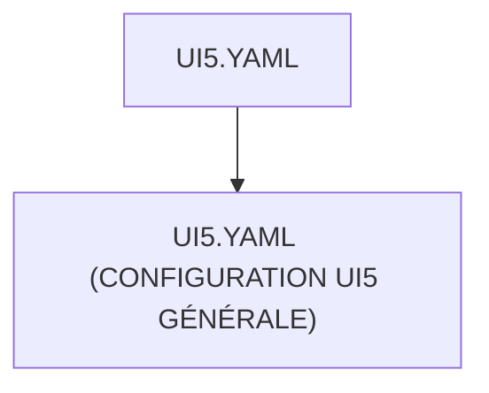

# 🌸 UI5.YAML

## 🌺 OBJECTIFS

- [ ] Expliquer le rôle de **UI5.YAML** dans le contexte présenté.
- [ ] Comprendre **ui5.yaml (configuration ui5 générale)**.
- [ ] Appliquer la notion dans un exemple simple.
- [ ] Reconnaître les erreurs fréquentes et les limites de l’approche.

## 🌺 VUE D'ENSEMBLE



## 🌺 UI5.YAML (CONFIGURATION UI5 GÉNÉRALE)

```
fgifirstappmodulename/
├── webapp/
│   ├── (annotations/)
│   ├── controller/
│   ├── css/
│   ├── i18n/
│   ├── libs/
│   ├── localService/
│   ├── model/
│   ├── view/
│   │
│   ├── Component.js
│   ├── index.html
│   └── manifest.json
│
├── .gitignore
├── (mta.yaml)
├── package-lock.json
├── package.json
├── README.md
├── ui5-local.yaml
├── ui5-mock.yaml
│
└── ui5.yaml # <- Config UI5
```

> [!IMPORTANT]
>
> - 🎯 Objectif
>   Définir la configuration standard de l’application UI5.
> - 🔨 Utilité : Déclarer le build, la structure des ressources, et les chemins du projet.
> - ⌚ Quand utilisé ? Lors de l’exécution de commandes UI5 (`build`, `preview`, `deploy`).

📌 Exemple :

```yaml
# yaml-language-server: $schema=https://sap.github.io/ui5-tooling/schema/ui5.yaml.json

##############################################################################
# UI5 TOOLING CONFIGURATION (DEV SERVER)
##############################################################################

specVersion: "4.0"

metadata:
  # Identifiant technique du projet UI5
  name: fr.stms.fgifirstappmodulename

type: application

server:
  customMiddleware:
    ############################################################################
    # FIORI TOOLS PROXY
    # --------------------------------------------------------------------------
    # Rôle :
    # - proxy HTTP pour appels backend SAP
    # - évite les problèmes CORS en développement
    # - redirige /sap vers système ABAP distant
    ############################################################################
    - name: fiori-tools-proxy
      afterMiddleware: compression

      configuration:
        # Autorise certificats invalides (DEV uniquement)
        ignoreCertErrors: false

        ui5:
          # Ressources UI5 chargées depuis CDN SAP
          path:
            - /resources
            - /test-resources
          url: https://ui5.sap.com

        backend:
          # Proxy vers backend ABAP
          - path: /sap
            url: https://my-sap-system.example.com
            client: "200"

    ############################################################################
    # LIVE RELOAD
    # --------------------------------------------------------------------------
    # Recharge automatique du navigateur lors des modifications
    ############################################################################
    - name: fiori-tools-appreload
      afterMiddleware: compression
      configuration:
        port: 35729
        path: webapp
        delay: 300

    ############################################################################
    # FIORI LAUNCHPAD PREVIEW
    # --------------------------------------------------------------------------
    # Lance l’application dans un FLP simulé
    ############################################################################
    - name: fiori-tools-preview
      afterMiddleware: fiori-tools-appreload
      configuration:
        flp:
          theme: sap_horizon
```

## 🌺 RÉSUMÉ

> - Savoir utiliser **ui5.yaml (configuration ui5 générale)** dans le contexte présenté.

<details>
<summary>🍧 Afficher l’auto-évaluation</summary>

- [ ] Je peux définir **UI5.YAML** avec mes propres mots.
- [ ] Je peux expliquer **ui5.yaml (configuration ui5 générale)** sans relire le chapitre.
- [ ] Je peux appliquer ou illustrer **un exemple concret** dans un exemple simple.
- [ ] Je peux identifier au moins une erreur fréquente ou une limite liée à cette notion.

</details>
