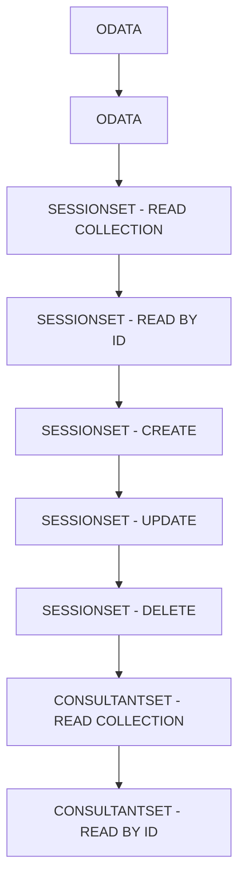

# 🌸 SOMMAIRE — ODATA

## 🌺 OBJECTIFS DU COURS

- [ ] Comprendre la progression générale du cours.
- [ ] Identifier l’ordre conseillé des chapitres.
- [ ] Retrouver rapidement une notion précise.

## 🌺 PARCOURS

> [!IMPORTANT]
> Suivre les chapitres dans l’ordre numérique, sauf révision ciblée d’une notion déjà étudiée.

## 🌺 CHAPITRES

- [ODATA](<./01 - 🍧 ODATA.md>)
- [SESSIONSET - READ COLLECTION](<./02 - 🍧 SESSIONSET - READ COLLECTION.md>)
- [SESSIONSET - READ BY ID](<./03 - 🍧 SESSIONSET - READ BY ID.md>)
- [SESSIONSET - CREATE](<./04 - 🍧 SESSIONSET - CREATE.md>)
- [SESSIONSET - UPDATE](<./05 - 🍧 SESSIONSET - UPDATE.md>)
- [SESSIONSET - DELETE](<./06 - 🍧 SESSIONSET - DELETE.md>)
- [CONSULTANTSET - READ COLLECTION](<./07 - 🍧 CONSULTANTSET - READ COLLECTION.md>)
- [CONSULTANTSET - READ BY ID](<./08 - 🍧 CONSULTANTSET - READ BY ID.md>)
- [CONSULTANTSET - CREATE](<./09 - 🍧 CONSULTANTSET - CREATE.md>)
- [CONSULTANTSET - UPDATE](<./10 - 🍧 CONSULTANTSET - UPDATE.md>)
- [CONSULTANTSET - DELETE](<./11 - 🍧 CONSULTANTSET - DELETE.md>)

Afficher la méthode de travail

1. Lire les objectifs du chapitre.
2. Étudier le schéma Mermaid.
3. Reproduire les exemples.
4. Réaliser l’exercice sans consulter la correction.
5. Valider l’auto-évaluation.

## 🌺 RÉSUMÉ

> - Ce sommaire représente le parcours du cours **ODATA**.
> - Les liens pointent vers les chapitres conservés dans leur emplacement d’origine.
