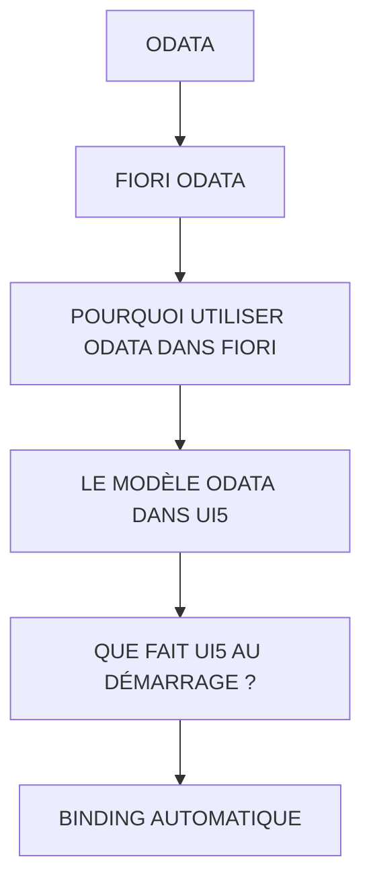

# 🌸 ODATA

## 🌺 OBJECTIFS

- [ ] Expliquer le rôle de **ODATA** dans le contexte présenté.
- [ ] Comprendre **fiori odata**.
- [ ] Mettre en œuvre **pourquoi utiliser odata dans fiori** dans un exemple guidé.
- [ ] Reconnaître les erreurs fréquentes et les limites de l’approche.

## 🌺 VUE D'ENSEMBLE



> [!IMPORTANT]
> Vérifier la version SAPUI5 ciblée par l’application. La disponibilité d’une API, d’une propriété ou d’un événement peut dépendre de cette version.

## 🌺 FIORI ODATA

Dans SAP Fiori :

- UI5 affiche les données
- SAP fournit les données
- OData transporte les données

Explication :

| Élément       | Rôle                     |
| ------------- | ------------------------ |
| UI5           | Interface utilisateur    |
| ODataModel    | Gestion des appels OData |
| Service OData | Expose les données       |
| Backend SAP   | Fournit les données      |

## 🌺 POURQUOI UTILISER ODATA DANS FIORI

Sans OData :

     Application
     ↓
     Appels HTTP manuels
     ↓
     Traitement manuel JSON
     ↓
     SAP

Avec OData :

     Application
     ↓
     ODataModel
     ↓
     SAP

Avantages :

- standard SAP
- CRUD intégré
- binding automatique
- compatible Fiori
- moins de code
- réutilisable

## 🌺 LE MODÈLE ODATA DANS UI5

Cette configuration se trouve généralement dans :

     manifest.json

Le modèle OData est généralement déclaré dans :

```json
"sap.ui5": {
    "models": {
        "": {
            "dataSource": "mainService"
        }
    }
}
```

## 🌺 QUE FAIT UI5 AU DÉMARRAGE ?

Lorsque l'application démarre :

     1. Chargement du manifest

     2. Création automatique du ODataModel

     3. Chargement des metadata

     4. Connexion au service

     5. Données disponibles dans l'application

Le développeur n'a généralement rien à créer manuellement.

## 🌺 BINDING AUTOMATIQUE

Exemple View :

```xml
<mvc:View
    controllerName="fr.stms.fgifirstappmodulename.controller.Home"
    xmlns:mvc="sap.ui.core.mvc"
    xmlns="sap.m"
>
    <Page
        id="page"
        title="{i18n>title}"
    >
        <content>

            <!-- ===================== -->
            <!-- TABLE SESSIONSET -->
            <!-- ===================== -->
            <Table
                id="sessionTable"
                items="{/SessionSet}"
                inset="false"
                headerText="Sessions">

                <columns>
                    <Column><Text text="IdSession"/></Column>
                    <Column><Text text="Année"/></Column>
                    <Column><Text text="Durée"/></Column>
                    <Column><Text text="Site"/></Column>
                </columns>

                <items>
                    <ColumnListItem>
                        <cells>
                            <Text text="{IdSession}"/>
                            <Text text="{Annee}"/>
                            <Text text="{Duree}"/>
                            <Text text="{Site}"/>
                        </cells>
                    </ColumnListItem>
                </items>

            </Table>

            <!-- ===================== -->
            <!-- TABLE CONSULTANTSET -->
            <!-- ===================== -->
            <Table
                id="consultantTable"
                items="{/ConsultantSet}"
                inset="false"
                headerText="Consultants">

                <columns>
                    <Column><Text text="Session"/></Column>
                    <Column><Text text="IdConsultant"/></Column>
                    <Column><Text text="Nom"/></Column>
                    <Column><Text text="Entreprise"/></Column>
                    <Column><Text text="Ville"/></Column>
                    <Column><Text text="Pays"/></Column>
                    <Column><Text text="Lang"/></Column>
                </columns>

                <items>
                    <ColumnListItem>
                        <cells>
                            <Text text="{IdSession}"/>
                            <Text text="{IdConsultant}"/>
                            <Text text="{Name}"/>
                            <Text text="{Entreprise}"/>
                            <Text text="{City}"/>
                            <Text text="{Country}"/>
                            <Text text="{Lang}"/>
                        </cells>
                    </ColumnListItem>
                </items>

            </Table>

        </content>

    </Page>
</mvc:View>

```

Explication :

     {/SessionSet}
     ↓
     La Table recherche les données de SessionSet

     {IdSession}
     ↓
     récupère IdSession de SessionSet

     {Site}
     ↓
     récupère Site SessionSet

UI5 fait automatiquement :

     GET /SessionSet

Aucun read() manuel n'est nécessaire.

## 🌺 RÉSUMÉ

> - Savoir utiliser **fiori odata** dans le contexte présenté.
> - **Pourquoi utiliser odata dans fiori :** Traitement manuel JSON
> - **Le modèle odata dans ui5 :** Cette configuration se trouve généralement dans :

<details>
<summary>🍧 Afficher l’auto-évaluation</summary>

- [ ] Je peux définir **ODATA** avec mes propres mots.
- [ ] Je peux expliquer **fiori odata** sans relire le chapitre.
- [ ] Je peux appliquer ou illustrer **pourquoi utiliser odata dans fiori** dans un exemple simple.
- [ ] Je peux identifier au moins une erreur fréquente ou une limite liée à cette notion.

</details>
