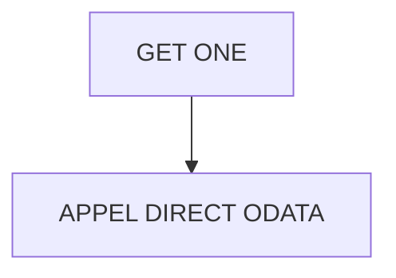

# 🌸 GET ONE

## 🌺 OBJECTIFS

- [ ] Expliquer le rôle de **GET ONE** dans le contexte présenté.
- [ ] Comprendre **appel direct odata**.
- [ ] Appliquer la notion dans un exemple simple.
- [ ] Reconnaître les erreurs fréquentes et les limites de l’approche.
## 🌺 VUE D'ENSEMBLE



> [!IMPORTANT]
> Vérifier la version SAPUI5 ciblée par l’application. La disponibilité d’une API, d’une propriété ou d’un événement peut dépendre de cette version.


## 🌺 APPEL DIRECT ODATA

Path :

     webapp/controller/Home.controller.js

Code :

```js
/**
 * sap.ui.define
 * ---------------------------------------------------------------------------
 * Module SAPUI5 : contrôleur Home
 *
 * Rôle :
 * - hérite du BaseController (logique commune)
 * - expose un Formatter pour la vue
 * - exécute des appels OData (READ collection + READ by ID)
 */
sap.ui.define(
  [
    /**********************************************************************
     * BaseController
     * --------------------------------------------------------------------
     * Contrôleur parent contenant les utilitaires :
     * - getModel()
     * - setModel()
     * - getRouter()
     **********************************************************************/
    "fr/stms/fgifirstappmodulename/controller/BaseController",

    /**********************************************************************
     * Formatter
     * --------------------------------------------------------------------
     * Fonctions utilitaires de transformation UI
     **********************************************************************/
    "fr/stms/fgifirstappmodulename/libs/Formatter",
  ],

  (BaseController, Formatter) => {
    "use strict";

    return BaseController.extend(
      "fr.stms.fgifirstappmodulename.controller.Home",
      {
        /******************************************************************
         * Formatter exposé à la View XML
         ******************************************************************/
        formatter: Formatter,

        /* ================================================================== */
        /* ODATA CALL FROM CONTROLLER                                        */
        /* ================================================================== */

        /**********************************************************************
         * onInit
         * --------------------------------------------------------------------
         * Hook lifecycle SAPUI5.
         *
         * Exécuté automatiquement à l’instanciation du contrôleur.
         *
         * Rôle ici :
         * - récupérer le modèle OData
         * - lancer les appels de démonstration
         **********************************************************************/
        onInit: function () {
          /******************************************************************
           * Récupération du modèle OData défini dans manifest.json
           *
           * this.getOwnerComponent().getModel()
           * -> modèle par défaut (OData V2 ici)
           ******************************************************************/
          var oModel = this.getOwnerComponent().getModel();

          console.log("INIT START");

          /* ================================================================
           * READ COLLECTION
           * ================================================================ */
          this.readSessions(oModel);

          /* ================================================================
           * READ SINGLE ENTITY
           * ================================================================ */
          this.readSessionById(oModel, "S001");
        },

        /* ================================================================== */
        /* READ COLLECTION                                                   */
        /* ================================================================== */

        /**********************************************************************
         * Lecture de la collection /SessionSet
         *
         * @param {sap.ui.model.odata.v2.ODataModel} oModel
         **********************************************************************/
        readSessions: function (oModel) {
          oModel.read("/SessionSet", {
            /****************************************************************
             * SUCCESS CALLBACK
             * --------------------------------------------------------------
             * OData.results = tableau d'entités retournées par OData
             ****************************************************************/
            success: function (OData) {
              console.log("READ SessionSet OK");

              console.table(OData.results);
            },

            /****************************************************************
             * ERROR CALLBACK
             * --------------------------------------------------------------
             * Exécuté si requête HTTP échoue
             ****************************************************************/
            error: function (oError) {
              console.error("READ SessionSet ERROR", oError);
            },
          });
        },

        /* ================================================================== */
        /* READ ONE ENTITY                                                   */
        /* ================================================================== */

        /**********************************************************************
         * Lecture d’une entité unique SessionSet
         *
         * @param {sap.ui.model.odata.v2.ODataModel} oModel
         * @param {string} sSessionId
         **********************************************************************/
        readSessionById: function (oModel, sSessionId) {
          /******************************************************************
           * Construction dynamique de l’URL OData
           *
           * Format OData V2 :
           * /EntitySet('ID')
           ******************************************************************/
          oModel.read("/SessionSet('" + sSessionId + "')", {
            success: function (OData) {
              console.log("READ ONE Session OK");

              console.log(OData);
            },

            error: function (oError) {
              console.error("READ ONE Session ERROR", oError);
            },
          });
        },
      },
    );
  },
);
```

## 🌺 RÉSUMÉ

> - **Appel direct odata :** webapp/controller/Home.controller.js

<details>
<summary>🍧 Afficher l’auto-évaluation</summary>

- [ ] Je peux définir **GET ONE** avec mes propres mots.
- [ ] Je peux expliquer **appel direct odata** sans relire le chapitre.
- [ ] Je peux appliquer ou illustrer **un exemple concret** dans un exemple simple.
- [ ] Je peux identifier au moins une erreur fréquente ou une limite liée à cette notion.

</details>
