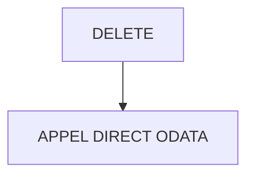

# 🌸 DELETE

## 🌺 OBJECTIFS

- [ ] Expliquer le rôle de **DELETE** dans le contexte présenté.
- [ ] Comprendre **appel direct odata**.
- [ ] Appliquer la notion dans un exemple simple.
- [ ] Reconnaître les erreurs fréquentes et les limites de l’approche.
## 🌺 VUE D'ENSEMBLE



> [!IMPORTANT]
> Vérifier la version SAPUI5 ciblée par l’application. La disponibilité d’une API, d’une propriété ou d’un événement peut dépendre de cette version.


## 🌺 APPEL DIRECT ODATA

Path :

     webapp/controller/Home.controller.js

Code :

```js
/**
 * sap.ui.define
 * ---------------------------------------------------------------------------
 * Contrôleur Home SAPUI5
 *
 * Rôle :
 * - contrôleur principal de la vue Home
 * - exécute des opérations CRUD OData V2
 * - expose Formatter pour la vue XML
 */
sap.ui.define(
  [
    "fr/stms/fgifirstappmodulename/controller/BaseController",
    "fr/stms/fgifirstappmodulename/libs/Formatter",
  ],
  (BaseController, Formatter) => {
    "use strict";

    return BaseController.extend(
      "fr.stms.fgifirstappmodulename.controller.Home",
      {
        /******************************************************************
         * Formatter exposé à la View XML
         ******************************************************************/
        formatter: Formatter,

        /* ================================================================== */
        /* ODATA CALL FROM CONTROLLER                                        */
        /* ================================================================== */

        /**********************************************************************
         * onInit
         * --------------------------------------------------------------------
         * Cycle de vie SAPUI5.
         *
         * Exécuté automatiquement au chargement du contrôleur.
         *
         * Ici :
         * - récupération du modèle OData
         * - lancement d’une suite CRUD de démonstration
         **********************************************************************/
        onInit: function () {
          var oModel = this.getOwnerComponent().getModel();

          console.log("INIT START");

          /* ================================================================
           * READ COLLECTION
           * ================================================================ */
          this.readSessions(oModel);

          /* ================================================================
           * READ ONE ENTITY
           * ================================================================ */
          this.readSessionById(oModel, "S001");

          /* ================================================================
           * CREATE ENTITY
           * ================================================================ */
          this.createSession(oModel);

          /* ================================================================
           * UPDATE ENTITY
           * ================================================================ */
          this.updateSession(oModel);

          /* ================================================================
           * DELETE ENTITY
           * ================================================================ */
          this.deleteSession(oModel);
        },

        /* ================================================================== */
        /* READ COLLECTION                                                   */
        /* ================================================================== */

        readSessions: function (oModel) {
          oModel.read("/SessionSet", {
            success: function (OData) {
              console.log("READ SessionSet OK");

              /**************************************************************
               * OData.results
               * -> tableau des entités OData retournées
               **************************************************************/
              console.table(OData.results);
            },

            error: function (oError) {
              console.error("READ SessionSet ERROR", oError);
            },
          });
        },

        /* ================================================================== */
        /* READ ONE ENTITY                                                   */
        /* ================================================================== */

        readSessionById: function (oModel, sSessionId) {
          oModel.read("/SessionSet('" + sSessionId + "')", {
            success: function (OData) {
              console.log("READ ONE Session OK");
              console.log(OData);
            },

            error: function (oError) {
              console.error("READ ONE Session ERROR", oError);
            },
          });
        },

        /* ================================================================== */
        /* CREATE ENTITY                                                     */
        /* ================================================================== */

        createSession: function (oModel) {
          var oPayload = {
            IdSession: "S006",
            Annee: "2027",
            Duree: "90",
            Site: "Marseille",
          };

          oModel.create("/SessionSet", oPayload, {
            success: function (OData) {
              console.log("CREATE Session OK", OData);
            },

            error: function (oError) {
              console.error("CREATE Session ERROR", oError);
            },
          });
        },

        /* ================================================================== */
        /* UPDATE ENTITY                                                     */
        /* ================================================================== */

        updateSession: function (oModel) {
          var oPayload = {
            /****************************************************************
             * UPDATE PARTIEL (PATCH OData V2)
             *
             * Seuls les champs fournis sont modifiés côté backend
             ****************************************************************/
            Annee: "2027",
            Duree: "120",
            Site: "Lille",
          };

          /******************************************************************
           * UPDATE OData V2
           *
           * Syntaxe :
           * oModel.update(path, data)
           *
           * Ici :
           * - /SessionSet('S006') = clé primaire de l'entité
           ******************************************************************/
          oModel.update("/SessionSet('S006')", oPayload);
        },

        /* ================================================================== */
        /* DELETE ENTITY                                                     */
        /* ================================================================== */

        deleteSession: function (oModel) {
          /******************************************************************
           * DELETE OData V2
           *
           * Supprime une entité identifiée par sa clé primaire
           ******************************************************************/
          oModel.remove("/SessionSet('S006')");
        },
      },
    );
  },
);
```

## 🌺 RÉSUMÉ

> - **Appel direct odata :** webapp/controller/Home.controller.js

<details>
<summary>🍧 Afficher l’auto-évaluation</summary>

- [ ] Je peux définir **DELETE** avec mes propres mots.
- [ ] Je peux expliquer **appel direct odata** sans relire le chapitre.
- [ ] Je peux appliquer ou illustrer **un exemple concret** dans un exemple simple.
- [ ] Je peux identifier au moins une erreur fréquente ou une limite liée à cette notion.

</details>
