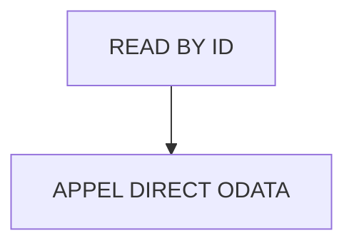

# 🌸 READ BY ID

## 🌺 OBJECTIFS

- [ ] Expliquer le rôle de **READ BY ID** dans le contexte présenté.
- [ ] Comprendre **appel direct odata**.
- [ ] Appliquer la notion dans un exemple simple.
- [ ] Reconnaître les erreurs fréquentes et les limites de l’approche.

## 🌺 VUE D'ENSEMBLE



> [!IMPORTANT]
> Vérifier la version SAPUI5 ciblée par l’application. La disponibilité d’une API, d’une propriété ou d’un événement peut dépendre de cette version.

## 🌺 APPEL DIRECT ODATA

Path :

     webapp/controller/Home.controller.js

Code :

```js
sap.ui.define(
  [
    "fr/stms/fgifirstappmodulename/controller/BaseController",
    "fr/stms/fgifirstappmodulename/libs/Formatter",
  ],
  (BaseController, Formatter) => {
    "use strict";

    return BaseController.extend(
      "fr.stms.fgifirstappmodulename.controller.Home",
      {
        /**
         * Formatter UI
         * @type {Object}
         */
        formatter: Formatter,

        /* ====================================================================== */
        /* ODATA CALL FROM CONTROLLER                                             */
        /* ====================================================================== */

        /**
         * Init controller
         * Lance toutes les opérations CRUD de démonstration sur S006
         */
        onInit: function () {
          var oModel = this.getOwnerComponent().getModel();

          console.log("INIT START");

          /* =========================
           * READ COLLECTION
           * ========================= */

          this.readSessions(oModel);
          this.readConsultants(oModel);

          /* =========================
           * READ ONE
           * ========================= */

          this.readSessionById(oModel, "S001");
          this.readConsultantById(oModel, "S001", "C001");

          /* =========================
           * CREATE
           * ========================= */

          this.createSession(oModel);

          /* =========================
           * UPDATE
           * ========================= */

          this.updateSession(oModel);

          /* =========================
           * DELETE
           * ========================= */

          this.deleteSession(oModel);
        },

        /* =========================
         * READ COLLECTION
         * ========================= */

        readSessions: function (oModel) {
          oModel.read("/SessionSet", {
            success: function (OData) {
              console.log("READ SessionSet OK");

              console.table(OData.results);
            },

            error: function (oError) {
              console.error("READ SessionSet ERROR", oError);
            },
          });
        },

        readConsultants: function (oModel) {
          oModel.read("/ConsultantSet", {
            success: function (OData) {
              console.log("READ ConsultantSet OK");

              console.table(OData.results);
            },

            error: function (oError) {
              console.error("READ ConsultantSet ERROR", oError);
            },
          });
        },

        /* =========================
         * READ ONE
         * ========================= */

        readSessionById: function (oModel, sSessionId) {
          oModel.read("/SessionSet('" + sSessionId + "')", {
            success: function (OData) {
              console.log("READ ONE Session OK");

              console.log(OData);
            },

            error: function (oError) {
              console.error("READ ONE Session ERROR", oError);
            },
          });
        },

        readConsultantById: function (oModel, sSessionId, sConsultantId) {
          oModel.read(
            "/ConsultantSet(IdSession='" +
              sSessionId +
              "',IdConsultant='" +
              sConsultantId +
              "')",
            {
              success: function (OData) {
                console.log("READ ONE Consultant OK");

                console.log(OData);
              },

              error: function (oError) {
                console.error("READ ONE Consultant ERROR", oError);
              },
            },
          );
        },

        /* =========================
         * CREATE
         * ========================= */

        createSession: function (oModel) {
          var oPayload = {
            IdSession: "S006",
            Annee: "2027",
            Duree: "90",
            Site: "Marseille",
          };

          oModel.create("/SessionSet", oPayload, {
            success: function (OData) {
              console.log("CREATE Session OK", OData);
            },

            error: function (oError) {
              console.error("CREATE Session ERROR", oError);
            },
          });
        },

        /* =========================
         * UPDATE
         * ========================= */

        updateSession: function (oModel) {
          var oPayload = {
            Annee: "2027",
            Duree: "120",
            Site: "Lille",
          };

          oModel.update("/SessionSet('S006')", oPayload);
        },

        /* =========================
         * DELETE
         * ========================= */

        deleteSession: function (oModel) {
          oModel.remove("/SessionSet('S006')");
        },
      },
    );
  },
);
```

## 🌺 RÉSUMÉ

> - **Appel direct odata :** webapp/controller/Home.controller.js

<details>
<summary>🍧 Afficher l’auto-évaluation</summary>

- [ ] Je peux définir **READ BY ID** avec mes propres mots.
- [ ] Je peux expliquer **appel direct odata** sans relire le chapitre.
- [ ] Je peux appliquer ou illustrer **un exemple concret** dans un exemple simple.
- [ ] Je peux identifier au moins une erreur fréquente ou une limite liée à cette notion.

</details>
