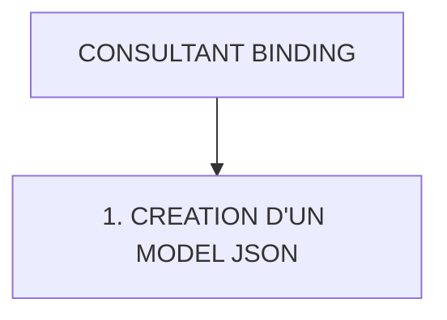

# 🌸 CONSULTANT BINDING

## 🌺 OBJECTIFS

- [ ] Expliquer le rôle de **CONSULTANT BINDING** dans le contexte présenté.
- [ ] Comprendre **1. création d'un model json**.
- [ ] Appliquer la notion dans un exemple simple.
- [ ] Reconnaître les erreurs fréquentes et les limites de l’approche.
## 🌺 VUE D'ENSEMBLE



> [!IMPORTANT]
> Vérifier la version SAPUI5 ciblée par l’application. La disponibilité d’une API, d’une propriété ou d’un événement peut dépendre de cette version.


## 🌺 1. CRÉATION D'UN MODEL JSON

Path :

     webapp/controller/Home.controller.js

Importer le JSONModel :

```js
sap.ui.define(
  [
    "fr/stms/fgifirstappmodulename/controller/BaseController",
    "fr/stms/fgifirstappmodulename/libs/Formatter",
    "fr/stms/fgifirstappmodulename/libs/DataServices",
    "sap/ui/model/json/JSONModel",
    "sap/m/MessageToast",
  ],
  (BaseController, Formatter, DataServices, JSONModel, MessageToast) => {
    "use strict";

    return BaseController.extend(
      "fr.stms.fgifirstappmodulename.controller.Home",
      {
        formatter: Formatter,

        _ODataServices: null,

        onInit: function () {
          const oModel = this.getOwnerComponent().getModel();

          this._ODataServices = new DataServices(oModel);

          this._oViewModel = new JSONModel({
            selectedSession: null,

            sessionForm: {
              IdSession: "",
              Annee: "",
              Duree: "",
              Site: "",
            },

            consultantForm: {
              IdSession: "",
              IdConsultant: "",
              Entreprise: "",
              Name: "",
              DateBirth: "",
              City: "",
              Region: "",
              Country: "",
              Lang: "",
            },
          });

          this.getView().setModel(this._oViewModel, "view");
        },

        /* ====================================================== */
        /* SESSION                                                */
        /* ====================================================== */

        onReadSessionById: function () {
          const oViewModel = this.getView().getModel("view");

          const sId = oViewModel.getProperty("/sessionForm/IdSession");

          this._ODataServices
            .getSessionById(sId)
            .then((res) => {
              oViewModel.setProperty("/sessionForm", res.data);
            })
            .catch((err) => {
              console.error("READ SessionById ERROR", err);
            });
        },

        onCreateSession: function () {
          const oViewModel = this.getView().getModel("view");

          const oPayload = oViewModel.getProperty("/sessionForm");

          this._ODataServices
            .createSession(oPayload)
            .then(() => {
              return this._ODataServices.getSessions();
            })
            .then(() => {
              this.getView().getModel().refresh(true);

              MessageToast.show("Session créée");
            })
            .catch((err) => {
              console.error("CREATE Session ERROR", err);
            });
        },

        onUpdateSession: function () {
          const oViewModel = this.getView().getModel("view");

          const oPayload = oViewModel.getProperty("/sessionForm");

          const sId = oPayload.IdSession;

          this._ODataServices
            .updateSession(sId, oPayload)
            .then(() => {
              return this._ODataServices.getSessions();
            })
            .then(() => {
              this.getView().getModel().refresh(true);

              MessageToast.show("Session modifiée");
            })
            .catch((err) => {
              console.error("UPDATE Session ERROR", err);
            });
        },

        onDeleteSession: function () {
          const oViewModel = this.getView().getModel("view");

          const sId = oViewModel.getProperty("/sessionForm/IdSession");

          this._ODataServices
            .deleteSession(sId)
            .then(() => {
              return this._ODataServices.getSessions();
            })
            .then(() => {
              this.getView().getModel().refresh(true);

              MessageToast.show("Session supprimée");
            })
            .catch((err) => {
              console.error("DELETE Session ERROR", err);
            });
        },

        /* ====================================================== */
        /* CONSULTANT                                             */
        /* ====================================================== */

        onReadConsultantById: function () {
          const oViewModel = this.getView().getModel("view");

          const sSessionId = oViewModel.getProperty(
            "/consultantForm/IdSession",
          );

          const sConsultantId = oViewModel.getProperty(
            "/consultantForm/IdConsultant",
          );

          this._ODataServices
            .getConsultantById(sSessionId, sConsultantId)
            .then((res) => {
              oViewModel.setProperty("/consultantForm", res.data);
            })
            .catch((err) => {
              console.error("READ ConsultantById ERROR", err);
            });
        },

        onCreateConsultant: function () {
          const oViewModel = this.getView().getModel("view");

          const oPayload = oViewModel.getProperty("/consultantForm");

          this._ODataServices
            .createConsultant(oPayload)
            .then(() => {
              return this._ODataServices.getConsultants();
            })
            .then(() => {
              this.getView().getModel().refresh(true);

              MessageToast.show("Consultant créé");
            })
            .catch((err) => {
              console.error("CREATE Consultant ERROR", err);
            });
        },

        onUpdateConsultant: function () {
          const oViewModel = this.getView().getModel("view");

          const oPayload = oViewModel.getProperty("/consultantForm");

          const sSessionId = oPayload.IdSession;

          const sConsultantId = oPayload.IdConsultant;

          this._ODataServices
            .updateConsultant(sSessionId, sConsultantId, oPayload)
            .then(() => {
              return this._ODataServices.getConsultants();
            })
            .then(() => {
              this.getView().getModel().refresh(true);

              MessageToast.show("Consultant modifié");
            })
            .catch((err) => {
              console.error("UPDATE Consultant ERROR", err);
            });
        },

        onDeleteConsultant: function () {
          const oViewModel = this.getView().getModel("view");

          const sSessionId = oViewModel.getProperty(
            "/consultantForm/IdSession",
          );

          const sConsultantId = oViewModel.getProperty(
            "/consultantForm/IdConsultant",
          );

          this._ODataServices
            .deleteConsultant(sSessionId, sConsultantId)
            .then(() => {
              return this._ODataServices.getConsultants();
            })
            .then(() => {
              this.getView().getModel().refresh(true);

              MessageToast.show("Consultant supprimé");
            })
            .catch((err) => {
              console.error("DELETE Consultant ERROR", err);
            });
        },
      },
    );
  },
);
```

## 🌺 RÉSUMÉ

> - **1. création d'un model json :** webapp/controller/Home.controller.js

<details>
<summary>🍧 Afficher l’auto-évaluation</summary>

- [ ] Je peux définir **CONSULTANT BINDING** avec mes propres mots.
- [ ] Je peux expliquer **1. creation d'un model json** sans relire le chapitre.
- [ ] Je peux appliquer ou illustrer **un exemple concret** dans un exemple simple.
- [ ] Je peux identifier au moins une erreur fréquente ou une limite liée à cette notion.

</details>
