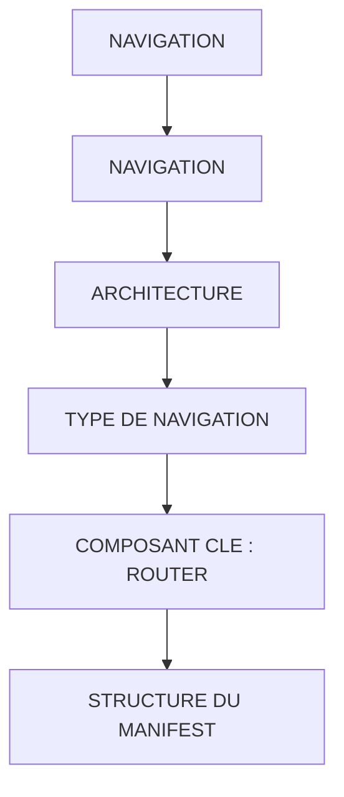

# 🌸 NAVIGATION

## 🌺 OBJECTIFS

- [ ] Expliquer le rôle de **NAVIGATION** dans le contexte présenté.
- [ ] Identifier les éléments techniques qui composent la notion.
- [ ] Mettre en œuvre **architecture** dans un exemple guidé.
- [ ] Reconnaître les erreurs fréquentes et les limites de l’approche.

## 🌺 VUE D'ENSEMBLE



> [!IMPORTANT]
> Vérifier la version SAPUI5 ciblée par l’application. La disponibilité d’une API, d’une propriété ou d’un événement peut dépendre de cette version.

## 🌺 NAVIGATION

La navigation SAPUI5 est le mécanisme permettant de changer de vue (View) ou d’écran dans une application, tout en conservant :

- l’état du composant
- le modèle de données
- le router central (Component.js)

## 🌺 ARCHITECTURE

    Component (Router)
    ↓
    Routes (manifest.json)
    ↓
    Targets (Views)
    ↓
    Controllers

## 🌺 TYPE DE NAVIGATION

### 🍧 NAVIGATION VIEW → VIEW

Changement d’écran dans la même application Fiori :

    Home → Detail
    List → Object
    Table → Form

### 🍧 NAVIGATION INTERNE

Pas de changement d’écran :

    sélection ligne table
    affichage formulaire
    mise à jour modèle

## 🌺 COMPOSANT CLE : ROUTER

Dans SAPUI5, la navigation repose sur l'instruction :

```js
this.getOwnerComponent().getRouter();

/*
========================================================
ACCÈS AU ROUTER SAPUI5
========================================================

- getOwnerComponent()
  → remonte au Component de l’application UI5
  → le Component est l’objet central de l’application
  → il contient la configuration globale (manifest.json)

- getRouter()
  → récupère l’instance du SAPUI5 Router définie dans le Component
  → ce Router gère la navigation entre vues (routing)

========================================================
RÔLE TECHNIQUE
========================================================

Cette ligne permet au Controller de :

- accéder au système de navigation de l’application
- déclencher une navigation vers une autre vue
- lire les routes définies dans manifest.json
- transmettre des paramètres d’URL (ex: IdSession)

========================================================
CONTEXTE D’UTILISATION
========================================================

Utilisé pour :

- navTo("routeName", params)
- getRoute("routeName").attachPatternMatched(...)
- navigation Master → Detail
- gestion du routing Fiori/SAPUI5

========================================================
DÉPENDANCE ARCHITECTURALE
========================================================

Le Router n’existe pas dans le Controller.
Il est instancié dans le Component.js à partir de la configuration manifest.json.
*/
```

## 🌺 STRUCTURE DU MANIFEST

Path :

     webapp/manifest.json

Structure concernée par la navigation et la mise en place des routes :

```json
/*
========================================================
SAPUI5 ROUTING CONFIGURATION (manifest.json)
========================================================
*/

"routing": {

  /*
  ======================================================
  CONFIGURATION GLOBALE DU ROUTER
  ======================================================
  */
  "config": {

    "routerClass": "sap.m.routing.Router",
    /*
    → Classe utilisée pour gérer la navigation
    → sap.m.routing.Router = router standard Fiori (mobile + responsive)
    */

    "controlAggregation": "pages",
    /*
    → Agrégation du control racine où les vues seront injectées
    → ici : "pages" (typique de sap.m.App)
    → signifie : les views seront ajoutées dans <App>
    */

    "controlId": "app",
    /*
    → ID du control racine dans App.view.xml
    → le router injecte les vues dans cet élément
    */

    "transition": "slide",
    /*
    → animation lors du changement de vue
    → slide = effet glissant (navigation Fiori standard)
    */

    "type": "View",
    /*
    → type de navigation cible
    → ici : XML Views
    */

    "viewType": "XML",
    /*
    → format des views utilisées dans l’application
    */

    "path": "fr.stms.fgifirstappmodulename.view",
    "viewPath": "fr.stms.fgifirstappmodulename.view",
    /*
    → namespace où se trouvent les views
    → utilisé pour résoudre automatiquement "Home" → Home.view.xml
    */

    "async": true
    /*
    → chargement asynchrone des views
    → améliore performance (lazy loading)
    */
  },

  /*
  ======================================================
  ROUTES = DÉCLARATION DES CHEMINS DE NAVIGATION
  ======================================================
  */
  "routes": [
    {
      "name": "RouteHome",
      /*
      → nom logique de la route
      → utilisé dans navTo("RouteHome")
      */

      "pattern": ":?query:",
      /*
      → pattern URL
      → ":?query:" = route optionnelle avec paramètres query
      → ici : Home accessible sans paramètre obligatoire
      */

      "target": [
        "TargetHome"
      ]
      /*
      → vue(s) affichée(s) quand la route est appelée
      */
    }
  ],

  /*
  ======================================================
  TARGETS = VUES RÉELLEMENT AFFICHÉES
  ======================================================
  */
  "targets": {
    "TargetHome": {

      "id": "Home",
      /*
      → ID de la View (Home.view.xml)
      */

      "name": "Home"
      /*
      → nom du fichier view sans extension
      → résolu via viewPath + name
      */
    }
  }
},

/*
========================================================
ROOT VIEW = POINT D’ENTRÉE DE L’APPLICATION
========================================================
*/
"rootView": {

  "viewName": "fr.stms.fgifirstappmodulename.view.App",
  /*
  → première view chargée au démarrage
  → conteneur principal de l’application
  */

  "type": "XML",
  /*
  → format de la root view
  */

  "id": "App",
  /*
  → ID du control root (utilisé par router.config.controlId)
  */

  "async": true
  /*
  → chargement asynchrone de la root view
  */
}
```

## 🌺 RÉSUMÉ

> - **Navigation :** La navigation SAPUI5 est le mécanisme permettant de changer de vue (View) ou d’écran dans une application, tout en conservant :
> - **Architecture :** Routes (manifest.json)
> - **Type de navigation :** Changement d’écran dans la même application Fiori :

<details>
<summary>🍧 Afficher l’auto-évaluation</summary>

- [ ] Je peux définir **NAVIGATION** avec mes propres mots.
- [ ] Je peux expliquer **navigation** sans relire le chapitre.
- [ ] Je peux appliquer ou illustrer **architecture** dans un exemple simple.
- [ ] Je peux identifier au moins une erreur fréquente ou une limite liée à cette notion.

</details>
