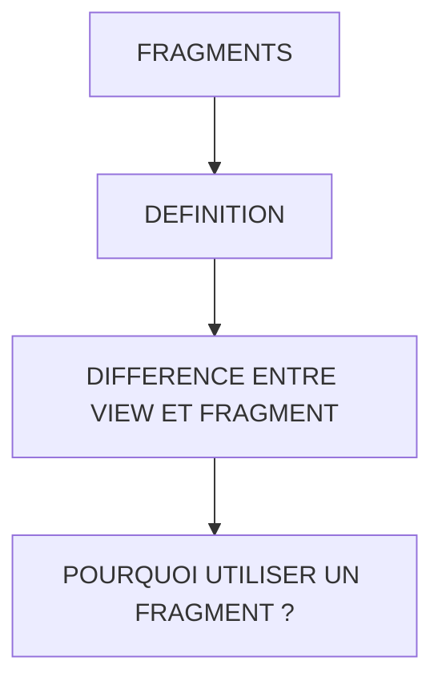

# 🌸 FRAGMENTS

## 🌺 OBJECTIFS

- [ ] Expliquer le rôle de **FRAGMENTS** dans le contexte présenté.
- [ ] Comprendre **définition**.
- [ ] Mettre en œuvre **difference entre view et fragment** dans un exemple guidé.
- [ ] Reconnaître les erreurs fréquentes et les limites de l’approche.

## 🌺 VUE D'ENSEMBLE



> [!IMPORTANT]
> Vérifier la version SAPUI5 ciblée par l’application. La disponibilité d’une API, d’une propriété ou d’un événement peut dépendre de cette version.

## 🌺 DÉFINITION

Un Fragment est un morceau de vue XML réutilisable.

L'idée est simple :

Au lieu d'écrire 300 lignes dans un seul Home.view.xml, on découpe l'interface en plusieurs fichiers.

Par exemple :

          view/
          │
          ├── Home.view.xml
          ├── Details.view.xml
          │
          └── fragments/
               ├── SessionForm.fragment.xml
               ├── ConsultantForm.fragment.xml
               ├── SessionTable.fragment.xml
               └── ConsultantTable.fragment.xml

Chaque fragment contient uniquement une partie de l'écran.

## 🌺 DIFFERENCE ENTRE VIEW ET FRAGMENT

Une View possède :

     un Controller
     un cycle de vie
     peut être routée

Exemple :

     Home.view.xml

associée à :

     Home.controller.js

Un Fragment :

     n'a PAS de Controller propre
     utilise le Controller de la View qui l'appelle
     ne peut pas être routé

Exemple :

     SessionForm.fragment.xml

Le code du fragment utilise directement :

```xml
<Button
    text="Create"
    press="onCreateSession"
/>
```

et c'est :

     Home.controller.js

qui exécute :

```js
onCreateSession();
```

## 🌺 POURQUOI UTILISER UN FRAGMENT ?

Sans fragment :

```xml
<Home.view.xml>

<!-- Form Session -->
<!-- Table Session -->
<!-- Form Consultant -->
<!-- Table Consultant -->
<!-- Dialog -->
<!-- Popover -->

<!-- 500 lignes... -->
```

Avec fragments :

```xml
<Home.view.xml>

     <core:Fragment
     fragmentName="...SessionForm"
     type="XML"
     />

     <core:Fragment
     fragmentName="...ConsultantForm"
     type="XML"
     />

     <!-- ... -->
```

Le code devient :

     plus lisible
     plus maintenable
     réutilisable

## 🌺 RÉSUMÉ

> - **Définition :** Un Fragment est un morceau de vue XML réutilisable.
> - **Difference entre view et fragment :** n'a PAS de Controller propre
> - Savoir utiliser **pourquoi utiliser un fragment ?** dans le contexte présenté.

<details>
<summary>🍧 Afficher l’auto-évaluation</summary>

- [ ] Je peux définir **FRAGMENTS** avec mes propres mots.
- [ ] Je peux expliquer **definition** sans relire le chapitre.
- [ ] Je peux appliquer ou illustrer **difference entre view et fragment** dans un exemple simple.
- [ ] Je peux identifier au moins une erreur fréquente ou une limite liée à cette notion.

</details>
