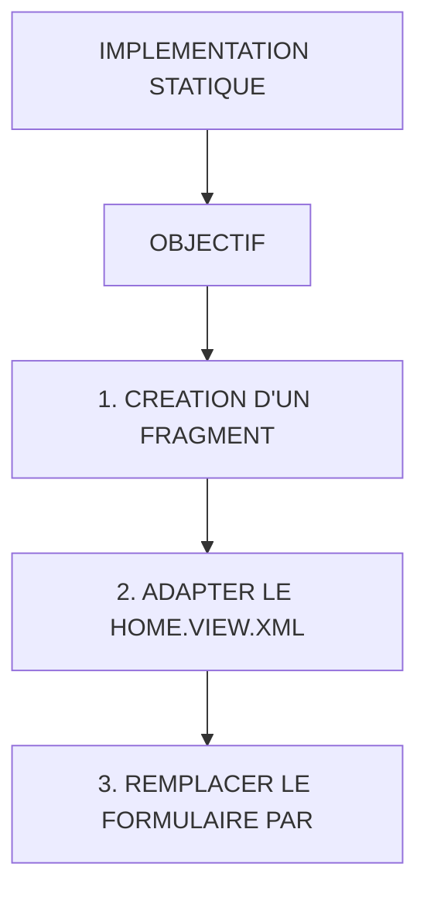

# 🌸 IMPLEMENTATION STATIQUE

## 🌺 OBJECTIFS

- [ ] Expliquer le rôle de **IMPLEMENTATION STATIQUE** dans le contexte présenté.
- [ ] Comprendre **1. création d'un fragment**.
- [ ] Mettre en œuvre **2. adapter le home.view.xml** dans un exemple guidé.
- [ ] Reconnaître les erreurs fréquentes et les limites de l’approche.

## 🌺 VUE D'ENSEMBLE



> [!IMPORTANT]
> Vérifier la version SAPUI5 ciblée par l’application. La disponibilité d’une API, d’une propriété ou d’un événement peut dépendre de cette version.

## 🌺 OBJECTIF

Nous souhaitons extraire le formulaire Session.

Actuellement dans Home.view.xml :

```js
<Panel headerText="Session Form">...</Panel>
```

## 🌺 1. CRÉATION D'UN FRAGMENT

Créer :

    webapp/view/fragments/SessionForm.fragment.xml

Code :

```js
<core:FragmentDefinition xmlns="sap.m" xmlns:core="sap.ui.core">
  <Panel headerText="Session Form" class="sapUiSmallMargin">
    <VBox>
      <Input value="{view>/sessionForm/IdSession}" placeholder="IdSession" />

      <Input value="{view>/sessionForm/Annee}" placeholder="Année" />

      <Input value="{view>/sessionForm/Duree}" placeholder="Durée" />

      <Input value="{view>/sessionForm/Site}" placeholder="Site" />

      <HBox>
        <Button text="READ BY ID" press="onReadSessionById" />

        <Button text="CREATE" press="onCreateSession" />

        <Button text="UPDATE" press="onUpdateSession" />

        <Button text="DELETE" press="onDeleteSession" />
      </HBox>
    </VBox>
  </Panel>
</core:FragmentDefinition>
```

## 🌺 2. ADAPTER LE HOME.VIEW.XML

Path :

    webapp/view/Home.view.xml

ajouter/vérifier la présence de :

```js
xmlns: core = "sap.ui.core";
```

dans la balise View :

```xml
<mvc:View
    controllerName="fr.stms.fgifirstappmodulename.controller.Home"
    xmlns:mvc="sap.ui.core.mvc"
    xmlns="sap.m"
    xmlns:core="sap.ui.core">
```

## 🌺 3. REMPLACER LE FORMULAIRE PAR

Path :

    webapp/view/Home.view.xml

```js
<core:Fragment
  fragmentName="fr.stms.fgifirstappmodulename.view.fragments.SessionForm"
  type="XML"
/>
```

## 🌺 RÉSUMÉ

> - **1. création d'un fragment :** webapp/view/fragments/SessionForm.fragment.xml
> - **2. adapter le home.view.xml :** webapp/view/Home.view.xml
> - **3. remplacer le formulaire par :** webapp/view/Home.view.xml

<details>
<summary>🍧 Afficher l’auto-évaluation</summary>

- [ ] Je peux définir **IMPLEMENTATION STATIQUE** avec mes propres mots.
- [ ] Je peux expliquer **objectif** sans relire le chapitre.
- [ ] Je peux appliquer ou illustrer **1. creation d'un fragment** dans un exemple simple.
- [ ] Je peux identifier au moins une erreur fréquente ou une limite liée à cette notion.

</details>
