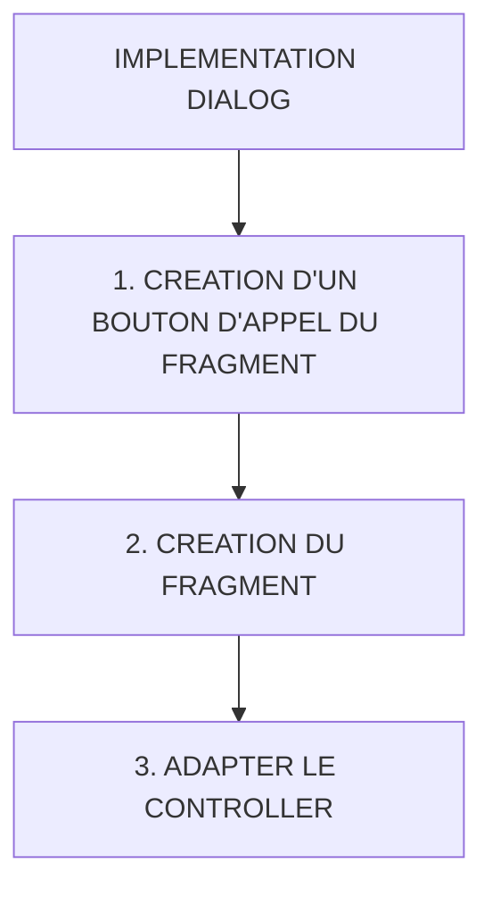

# 🌸 IMPLEMENTATION DIALOG

## 🌺 OBJECTIFS

- [ ] Expliquer le rôle de **IMPLEMENTATION DIALOG** dans le contexte présenté.
- [ ] Comprendre **1. création d'un bouton d'appel du fragment**.
- [ ] Mettre en œuvre **2. création du fragment** dans un exemple guidé.
- [ ] Reconnaître les erreurs fréquentes et les limites de l’approche.
## 🌺 VUE D'ENSEMBLE



> [!IMPORTANT]
> Vérifier la version SAPUI5 ciblée par l’application. La disponibilité d’une API, d’une propriété ou d’un événement peut dépendre de cette version.


## 🌺 1. CRÉATION D'UN BOUTON D'APPEL DU FRAGMENT

Créer :

    webapp/view/Home.view.xml

Code :

```js
<Button text="Créer une session" press="onOpenSessionDialog" />
```

## 🌺 2. CRÉATION DU FRAGMENT

Path :

    webapp/view/fragments/SessionDialog.fragment.xml

Code :

```xml
<core:FragmentDefinition
    xmlns="sap.m"
    xmlns:core="sap.ui.core">
    <Dialog
        id="sessionDialog"
        title="Nouvelle Session">

        <VBox class="sapUiSmallMargin">

            <Input
                value="{view>/sessionForm/IdSession}"
                placeholder="IdSession"/>

            <Input
                value="{view>/sessionForm/Annee}"
                placeholder="Année"/>

            <Input
                value="{view>/sessionForm/Duree}"
                placeholder="Durée"/>

            <Input
                value="{view>/sessionForm/Site}"
                placeholder="Site"/>

        </VBox>

        <beginButton>
            <Button
                text="Créer"
                type="Emphasized"
                press="onCreateSession"/>
        </beginButton>

        <endButton>
            <Button
                text="Fermer"
                press="onCloseSessionDialog"/>
        </endButton>

    </Dialog>

</core:FragmentDefinition>
```

## 🌺 3. ADAPTER LE CONTROLLER

Path :

    webapp/controller/Home.controller.js

Ajouter l'import `sap/ui/core/Fragment` :

```js
sap.ui.define(
  [
    "fr/stms/fgifirstappmodulename/controller/BaseController",
    "fr/stms/fgifirstappmodulename/libs/Formatter",
    "fr/stms/fgifirstappmodulename/libs/DataServices",
    "sap/ui/model/json/JSONModel",
    "sap/m/MessageToast",
    "sap/ui/core/Fragment",
  ],
  (
    BaseController,
    Formatter,
    DataServices,
    JSONModel,
    MessageToast,
    Fragment,
  ) => {
    /* ... */
  },
);
```

En dessous de

```js
 _ODataServices: null,
```

Ajouter :

```js
_oSessionDialog: null,
```

Puis ajouter les fonctions :

```js
/**
 * ==========================================================
 * OUVERTURE DE LA DIALOG SESSION
 * ==========================================================
 *
 * Objectif :
 * - charger le Fragment la première fois
 * - réutiliser ensuite la même Dialog
 *
 * Avantage :
 * - meilleures performances
 * - évite de recréer la Dialog à chaque clic
 */
onOpenSessionDialog: function () {

    /*
    ==========================================================
    PREMIÈRE OUVERTURE
    ==========================================================
    */
    if (!this._oSessionDialog) {

        /*
        ==========================================================
        CHARGEMENT ASYNCHRONE DU FRAGMENT
        ==========================================================
        Fragment.load() retourne une Promise.
        - il charge le fragment uniquement lorsqu'on en a besoin.
        - C'est plus performant que de charger tous les Dialogs dès l'ouverture de l'application.

        Le .then() sera exécuté lorsque le Fragment
        sera complètement chargé et créé.
        */
        Fragment.load({
            id: this.getView().getId(),
            name: "fr.stms.fgifirstappmodulename.view.fragments.SessionDialog",
            controller: this
        }).then((oDialog) => {

            /*
            ======================================================
            SAUVEGARDE DE L'INSTANCE
            ======================================================
            */
            this._oSessionDialog = oDialog;

            /*
            ======================================================
            ASSOCIATION À LA VIEW
            ======================================================
            addDependent Permet :
            - l'accès aux modèles
            - d'hériter des modèles de la View
            - d'hériter du cycle de vie de la View
            - la destruction automatique
            */
            this.getView().addDependent(oDialog);

            /*
            ======================================================
            OUVERTURE DE LA DIALOG
            ======================================================
            */
            oDialog.open();
        });

    } else {

        /*
        ==========================================================
        DIALOG DÉJÀ CHARGÉE
        ==========================================================
        Réutilisation de l'instance existante.
        */
        this._oSessionDialog.open();
    }
},

onCloseSessionDialog: function () {

    this._oSessionDialog.close();

},
```

## 🌺 RÉSUMÉ

> - **1. création d'un bouton d'appel du fragment :** webapp/view/Home.view.xml
> - **2. création du fragment :** webapp/view/fragments/SessionDialog.fragment.xml
> - **3. adapter le controller :** webapp/controller/Home.controller.js

<details>
<summary>🍧 Afficher l’auto-évaluation</summary>

- [ ] Je peux définir **IMPLEMENTATION DIALOG** avec mes propres mots.
- [ ] Je peux expliquer **1. creation d'un bouton d'appel du fragment** sans relire le chapitre.
- [ ] Je peux appliquer ou illustrer **2. creation du fragment** dans un exemple simple.
- [ ] Je peux identifier au moins une erreur fréquente ou une limite liée à cette notion.

</details>
