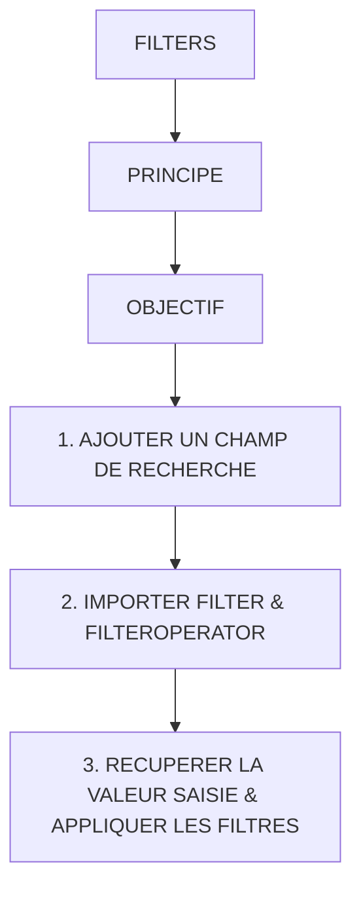

# 🌸 FILTERS

## 🌺 OBJECTIFS

- [ ] Expliquer le rôle de **FILTERS** dans le contexte présenté.
- [ ] Comprendre **principe**.
- [ ] Mettre en œuvre **1. ajouter un champ de recherche** dans un exemple guidé.
- [ ] Reconnaître les erreurs fréquentes et les limites de l’approche.

## 🌺 VUE D'ENSEMBLE



> [!IMPORTANT]
> Vérifier la version SAPUI5 ciblée par l’application. La disponibilité d’une API, d’une propriété ou d’un événement peut dépendre de cette version.

## 🌺 PRINCIPE

Sans filtre :

     ConsultantSet
     ├─ Dupont
     ├─ Martin
     ├─ Smith
     └─ Rossi

Avec filtre :

     Country = FR

résultat :

     ConsultantSet
     ├─ Dupont
     └─ Martin

## 🌺 OBJECTIF

Path :

     webapp/view/Home.view.xml

Ajouter des filtres sur la table :

```xml
<Table
    id="consultantTable"
    items="{/ConsultantSet}"
    inset="false"
    headerText="Consultants"
>
```

par exemple sur :

     Nom
     Entreprise
     Ville
     Pays

## 🌺 1. AJOUTER UN CHAMP DE RECHERCHE

Au-dessus de la table Consultant :

[sap.m.SearchField](https://sapui5.netweaver.ondemand.com/#/api/sap.m.SearchField)

```xml
<SearchField
     width="100%"
     placeholder="Rechercher un consultant (Nom)"
     liveChange="onFilterName"
/>

<SearchField
     width="100%"
     placeholder="Rechercher un consultant (Nom, Entreprise, Ville, Pays)"
     liveChange="onFilterConsultant"
/>
```

## 🌺 2. IMPORTER FILTER & FILTEROPERATOR

Path :

     webapp/controller/Home.controller.js

Code :

```js
sap.ui.define(
  [
    "fr/stms/fgifirstappmodulename/controller/BaseController",
    "fr/stms/fgifirstappmodulename/libs/Formatter",
    "fr/stms/fgifirstappmodulename/libs/DataServices",
    "sap/ui/model/json/JSONModel",
    "sap/m/MessageToast",
    "sap/ui/core/Fragment",
    "sap/ui/model/Filter",
    "sap/ui/model/FilterOperator",
  ],
  (
    BaseController,
    Formatter,
    DataServices,
    JSONModel,
    MessageToast,
    Fragment,
    Filter,
    FilterOperator,
  ) => {
    /* ... */
  },
);
```

## 🌺 3. RECUPERER LA VALEUR SAISIE & APPLIQUER LES FILTRES

Path :

     webapp/controller/Home.controller.js

Code :

```js
/**
 * ==========================================================
 * FILTRE SUR LA COLONNE "Name"
 * ==========================================================
 *
 * Objectif :
 * - filtrer la table des consultants
 * - selon la valeur tapée dans le champ de recherche
 *
 * Fonctionnement :
 * - récupération du texte saisi
 * - création d'un filtre SAPUI5
 * - application sur le binding de la table
 */
onFilterName: function (oEvent) {

    /*
    ==========================================================
    VALEUR SAISIE PAR L’UTILISATEUR
    ==========================================================
    */
    const sValue = oEvent.getParameter("newValue");

    /*
    ==========================================================
    RÉCUPÉRATION DE LA TABLE
    ==========================================================
    */
    const oTable = this.byId("consultantTable");

    /*
    ==========================================================
    BINDING DE LA TABLE
    ==========================================================
    */
    const oBinding = oTable.getBinding("items");

    /*
    ==========================================================
    CRÉATION DU FILTRE
    ==========================================================
    Filter :
    - champ : Name
    - opérateur : "contient"
    - valeur : texte utilisateur
    */
    const oFilter = new Filter(
        "Name",
        FilterOperator.Contains,
        sValue
    );

    /*
    ==========================================================
    APPLICATION DU FILTRE
    ==========================================================
    */
    oBinding.filter([oFilter]);
},

onFilterConsultant: function (oEvent) {

    /*
    ==========================================================
    1. Récupération valeur saisie dans le SearchField
    ==========================================================
    */
    const sQuery = oEvent.getParameter("newValue");

    /*
    ==========================================================
    2. Récupération binding de la table Consultant
    - "items" correspond à items="{/ConsultantSet}"
    ==========================================================
    */
    const oBinding = this.byId("consultantTable").getBinding("items");

    /*
    ==========================================================
    3. Si champ vide → suppression des filtres
    ==========================================================
    */
    if (!sQuery) {
        oBinding.filter([]);
        return;
    }

    /*
    ==========================================================
    4. Création des filtres multi-colonnes (OR logique)
    ==========================================================
    On recherche dans :
    - Name
    - Entreprise
    - City
    - Country
    */
    const oFilter = new Filter({
        filters: [
            new Filter(
                "Name",
                FilterOperator.Contains,
                sQuery
            ),
            new Filter(
                "Entreprise",
                FilterOperator.Contains,
                sQuery
            ),
            new Filter(
                "City",
                FilterOperator.Contains,
                sQuery
            ),
            new Filter(
                "Country",
                FilterOperator.Contains,
                sQuery
            )
        ],
        and: false
    });

    /*
    ==========================================================
    5. Application du filtre sur la table
    ==========================================================
    */
    oBinding.filter([oFilter]);

}
```

## 🌺 RÉSUMÉ

> - Savoir utiliser **principe** dans le contexte présenté.
> - **1. ajouter un champ de recherche :** Au-dessus de la table Consultant :
> - **2. importer filter & filteroperator :** webapp/controller/Home.controller.js

<details>
<summary>🍧 Afficher l’auto-évaluation</summary>

- [ ] Je peux définir **FILTERS** avec mes propres mots.
- [ ] Je peux expliquer **principe** sans relire le chapitre.
- [ ] Je peux appliquer ou illustrer **objectif** dans un exemple simple.
- [ ] Je peux identifier au moins une erreur fréquente ou une limite liée à cette notion.

</details>
