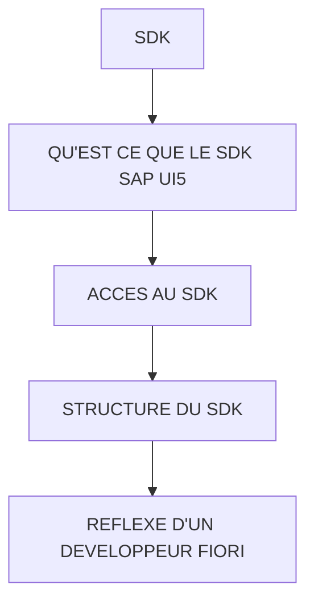

# 🌸 SDK

## 🌺 OBJECTIFS

- [ ] Expliquer le rôle de **SDK** dans le contexte présenté.
- [ ] Comprendre **qu'est ce que le sdk sap ui5**.
- [ ] Mettre en œuvre **acces au sdk** dans un exemple guidé.
- [ ] Reconnaître les erreurs fréquentes et les limites de l’approche.
## 🌺 VUE D'ENSEMBLE



> [!IMPORTANT]
> Vérifier la version SAPUI5 ciblée par l’application. La disponibilité d’une API, d’une propriété ou d’un événement peut dépendre de cette version.


## 🌺 QU'EST CE QUE LE SDK SAP UI5

Le SDK (Software Development Kit) est :

- la documentation officielle SAPUI5
- la référence de tous les contrôles
- un catalogue d'exemples
- un explorateur d'API

C'est l'outil principal du développeur Fiori.

## 🌺 ACCES AU SDK

Version publique :

[SAPUI5 SDK Demo Kit](https://ui5.sap.com/)

## 🌺 STRUCTURE DU SDK

### 🍧 1. Demo Kit

Permet :

     découvrir les contrôles
     consulter les tutoriels
     voir les exemples

Exemple :

     Button
     Table
     Dialog
     SmartTable
     SmartFilterBar

### 🍧 2. API Reference

Partie la plus utilisée.

Exemple :

     sap.m.Table

ou

     sap.m.Dialog

---

Pour chaque contrôle :

**Properties**

Exemple :

```xml
<Button
    text="Save"
    enabled="true"
/>
```

Documentation :

     text
     enabled
     visible
     width
     type

---

**Events**

Exemple :

```xml
<Button
    text="Save"
    press="onSave"
/>
```

Documentation :

     press
     tap

---

**Aggregations**

Exemple :

```xml
<Table>
    <columns>
    </columns>

    <items>
    </items>
</Table>
```

Documentation :

     columns
     items
     headerToolbar
     infoToolbar

Exemple : rechercher un contrôle

Supposons :

Je veux afficher une popup.

Recherche SDK :

Dialog

Résultat :

<Dialog
    title="Information">
</Dialog>

## 🌺 REFLEXE D'UN DEVELOPPEUR FIORI

Avant de coder :

     Identifier le contrôle recherché
     Ouvrir le SDK
     Lire les propriétés
     Lire les événements
     Regarder un Sample
     Adapter le code

C'est exactement la méthode utilisée sur les projets SAPUI5 réels.

## 🌺 RÉSUMÉ

> - **Qu'est ce que le sdk sap ui5 :** Le SDK (Software Development Kit) est :
> - Savoir utiliser **acces au sdk** dans le contexte présenté.
> - **Structure du sdk :** découvrir les contrôles

<details>
<summary>🍧 Afficher l’auto-évaluation</summary>

- [ ] Je peux définir **SDK** avec mes propres mots.
- [ ] Je peux expliquer **qu'est ce que le sdk sap ui5** sans relire le chapitre.
- [ ] Je peux appliquer ou illustrer **acces au sdk** dans un exemple simple.
- [ ] Je peux identifier au moins une erreur fréquente ou une limite liée à cette notion.

</details>
